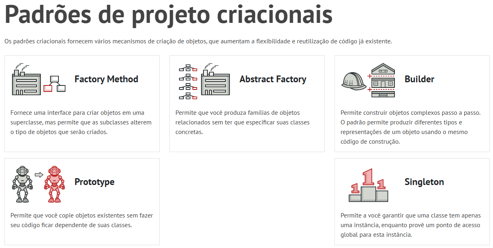

# 3.1. Módulo Padrões de Projeto GoFs Criacionais

---
## O que são Padrões de Projeto Criacionais?

Os **Padrões de Projeto Criacionais** fazem parte do catálogo da "Gang of Four" (GoF) e têm como objetivo principal **abstrair e encapsular o processo de criação de objetos** em sistemas orientados a objetos. Em vez de instanciar classes concretas diretamente (com o operador `new`), esses padrões fornecem mecanismos flexíveis que desacoplam o código cliente das classes específicas que precisam ser criadas.

Esses padrões são fundamentais para: **Reduzir o acoplamento** entre as classes de um sistema , **Aumentar a flexibilidade e a extensibilidade** do código , **Centralizar e controlar a lógica de criação** de objetos complexos e **Facilitar a manutenção e os testes** automatizados.

## Os Cinco Padrões Criacionais da GoF

Ao longo das aulas do terceiro módulo da disciplina, foram apresentados  cinco padrões criacionais:

Fonte: <a href="https://refactoring.guru/pt-br/design-patterns/creational-patterns" target="_blank">Refactoring Guru</a>, Padrões de projeto criacionais.

| Padrão | Propósito |
|--------|--------------------|
| **Factory Method** | Define uma interface para criar um objeto, mas permite que as subclasses decidam qual classe instanciar. |
| **Abstract Factory** | Fornece uma interface para criar famílias de objetos relacionados ou dependentes sem especificar suas classes concretas. |
| **Builder** | Separa a construção de um objeto complexo da sua representação, permitindo o mesmo processo de construção para diferentes representações. |
| **Prototype** | Cria novos objetos clonando (copiando) uma instância existente, evitando o custo de criação a partir do zero. |
| **Singleton** | Garante que uma classe tenha apenas uma única instância e fornece um ponto global de acesso a ela. |

Cada um desses padrões resolve um problema específico relacionado à criação de objetos, e a escolha de qual usar depende do contexto e das necessidades do sistema.

## Por que utilizar Padrões Criacionais?

A aplicação adequada de padrões criacionais traz diversos benefícios para o software:

1. **Desacoplamento** – O código cliente não precisa conhecer as classes concretas dos objetos que utiliza, apenas suas interfaces.
2. **Reutilização** – A lógica de criação pode ser reaproveitada em diferentes partes do sistema.
3. **Flexibilidade** – Novos tipos de objetos podem ser introduzidos sem modificar o código existente (Princípio Aberto/Fechado).
4. **Controle centralizado** – Regras de criação, validações e configurações ficam em um único local, facilitando a manutenção.
5. **Legibilidade** – A criação de objetos, especialmente os complexos, torna-se mais expressiva e menos propensa a erros.

## Próximos Passos

Como parte da disciplina, foi solicitada a implementação de **pelo menos um padrão criacional da GoF** no nosso projeto — o **Fórum TenhoUmaDica**. O grupo optou pela utilização de dois padrões criacionais distintos, visando atender a diferentes aspectos do domínio: [Factory Method](/PadroesDeProjeto/Criacionais/3.1.1.Factory.md) e [Builder](/PadroesDeProjeto/Criacionais/3.1.2.Builder.md).

---

# Referencias

1. **CARONA AMIGA**. *Documento de Entrega 03*. Disponível em: <https://unbarqdsw2025-2-turma02.github.io/2025.2-T02-_G2_CaronaAmigaFCTE_Entrega_03/#/>. Acesso em: 20/05/2026.
2. **JOGO DIGITAL**. *Documento de Entrega 03*. Disponível em: <https://unbarqdsw2025-2-turma01.github.io/2025.2-T01-G1_JogoDigital_Entrega_03/>. Acesso em: 20/05/2026.
3. **GALÁXIA CONECTADA**. *Documento de Entrega 03*. Disponível em: <https://unbarqdsw2025-1-turma02.github.io/2025.1_T02_G9_GalaxiaConectada_Entrega03/#/>. Acesso em: 20/05/2026.
4. **MÓDULO DE PADRÕES DE PROJETO CRIACIONAIS**. *Slides da professora*. Disponível em Aprender3: <https://aprender3.unb.br/mod/page/view.php?id=1523528>. Acesso em: 20/05/2026.
5. **REFACTORING GURU**. *Padrões de Projeto Criacionais*. Disponível em: <https://refactoring.guru/pt-br/design-patterns/creational-patterns>. Acesso em: 20/05/2026.

---
#  Histórico de versão

| Versão | Descrição | Autor(es) | Data |
| :----: | :--- | :--- | :---: |
| 1.0 | Versão inicial | [Marcos Bezerra](https://github.com/marcoslbz) | 20/05/2026 |
