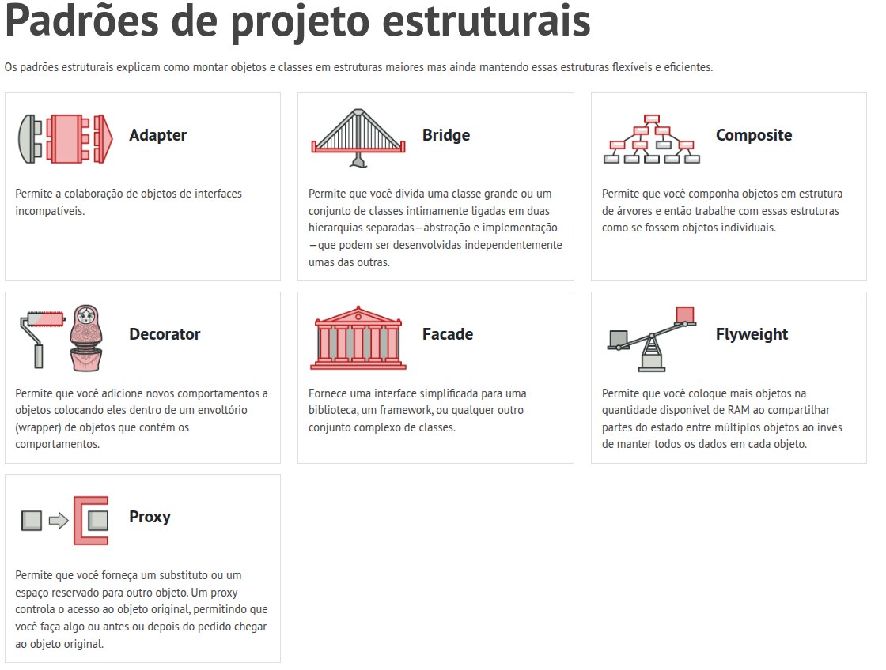

# 3.2. Módulo Padrões de Projeto GoFs Estruturais

---

## O que são Padrões de Projeto Estruturais?

Os **Padrões de Projeto Estruturais** fazem parte do catálogo da "Gang of Four" (GoF) e têm como objetivo principal lidar com a **composição de classes e objetos** para formar estruturas maiores e mais complexas. Esses padrões garantem que, mesmo que o sistema cresça e suas partes mudem, a estrutura geral permaneça flexível, eficiente e fácil de manter.

Esses padrões são fundamentais para: **Reduzir o acoplamento** entre interfaces incompatíveis, **Organizar a hierarquia** e as relações de dependência, **Simplificar a comunicação** com subsistemas complexos e **Garantir a escalabilidade** do design de software utilizando composição no lugar de heranças rígidas.

## Os Sete Padrões Estruturais da GoF

Ao longo das aulas do terceiro módulo da disciplina, foram apresentados sete padrões estruturais:

Fonte: <a href="https://refactoring.guru/pt-br/design-patterns/structural-patterns" target="_blank">Refactoring Guru</a>, Padrões de projeto criacionais.

| Padrão | Propósito |
| --- | --- |
| **Adapter** | Converte a interface de uma classe em outra interface esperada pelos clientes, permitindo que classes incompatíveis trabalhem juntas. |
| **Bridge** | Desacopla uma abstração da sua implementação, permitindo que ambas variem de forma independente. |
| **Composite** | Compõe objetos em estruturas de árvore para representar hierarquias partes-todo, permitindo que os clientes tratem objetos individuais e agrupamentos de maneira uniforme. |
| **Decorator** | Anexa responsabilidades adicionais a um objeto dinamicamente, fornecendo uma alternativa flexível à herança para extensão de funcionalidades. |
| **Facade** | Fornece uma interface unificada para um conjunto de interfaces em um subsistema, definindo um ponto de acesso de nível mais alto que facilita o uso. |
| **Flyweight** | Utiliza o compartilhamento para suportar eficientemente grandes quantidades de objetos de granulação fina, otimizando o uso de memória. |
| **Proxy** | Fornece um substituto ou marcador para outro objeto a fim de controlar o acesso a ele. |

Cada um desses padrões resolve um problema específico relacionado à arquitetura de classes e objetos, facilitando o trânsito de dados e a organização de elementos complexos em tempo de execução.

## Por que utilizar Padrões Estruturais?

A aplicação adequada de padrões estruturais traz diversos benefícios para o software:

1. **Integração de Sistemas** – Permitem que bibliotecas, APIs e componentes legados, muitas vezes incompatíveis, conversem perfeitamente com o código da nova aplicação (via Adapter ou Facade).
2. **Manutenibilidade** – Evitam que o sistema se torne um emaranhado de heranças profundas e complexas, priorizando a composição.
3. **Otimização de Recursos** – Ajudam a economizar memória e processamento ao lidar com instâncias pesadas ou repetitivas (via Flyweight ou Proxy).
4. **Tratamento Uniforme** – Simplificam a lógica do cliente ao permitir tratar um único elemento ou uma lista inteira de elementos exatamente com os mesmos métodos (via Composite).
5. **Flexibilidade Dinâmica** – Permitem adicionar comportamentos a objetos em tempo de execução sem afetar outras instâncias da mesma classe (via Decorator).

## Próximos Passos

Como parte da disciplina, foi solicitada a implementação de **pelo menos um padrão estrutural da GoF** no nosso projeto — o **Fórum TenhoUmaDica**. O grupo optou pela utilização dois padrões estruturais: [Composite](/PadroesDeProjeto/Estruturais/3.2.1.Composite.md) e [Facade](/PadroesDeProjeto/Estruturais/3.2.2.Facade.md).

---

# Referencias

1. **MÓDULO DE PADRÕES DE PROJETO ESTRUTURAIS**. *Slides da professora*. Disponível em Aprender3. Acesso em: 21/05/2026.
2. **REFACTORING GURU**. *Padrões de Projeto Estruturais*. Disponível em: [https://refactoring.guru/pt-br/design-patterns/structural-patterns](https://www.google.com/search?q=https://refactoring.guru/pt-br/design-patterns/structural-patterns). Acesso em: 21/05/2026.
3. **DEVMEDIA**. *Guia Completo: Padrões de Projeto em Java*. Disponível em: [https://www.devmedia.com.br/guia/padroes-de-projeto-em-java/34456](https://www.devmedia.com.br/guia/padroes-de-projeto-em-java/34456). Acesso em: 21/05/2026.

---

# Histórico de versão

| Versão | Descrição | Autor(es) | Data |
| --- | --- | --- | --- |
| 1.0 | Versão inicial | [Felipe de Jesus Rodrigues](https://www.github.com/felipeJRdev) | 21/05/2026 |