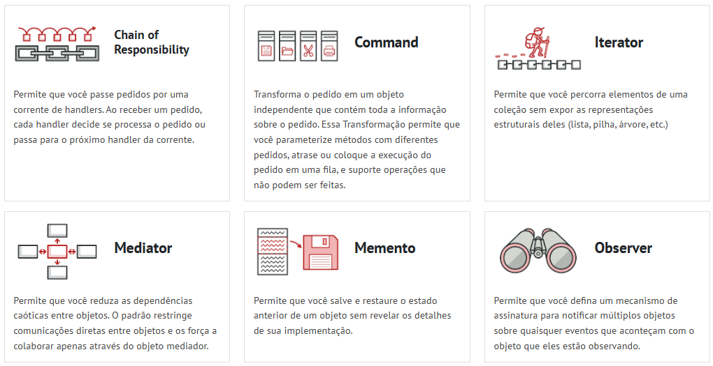
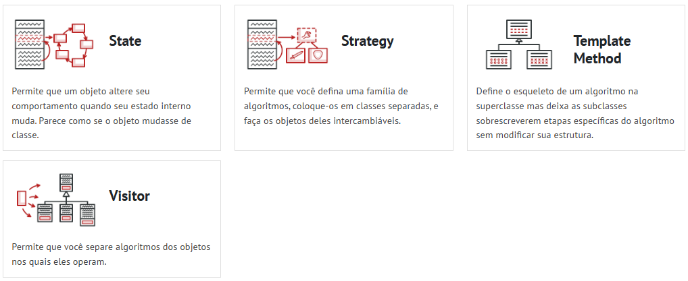

# 3.3. Módulo Padrões de Projeto GoFs Comportamentais

Os padrões de projeto GoFs (Gang of Four) comportamentais são responsáveis por definir formas eficientes de comunicação, colaboração e distribuição de responsabilidades entre objetos dentro de um sistema orientado a objetos. Diferentemente dos padrões criacionais, que focam na criação de objetos, ou dos estruturais, que organizam relações entre classes, os padrões comportamentais tratam principalmente do comportamento dinâmico do sistema e da forma como os objetos interagem em tempo de execução.

Esses padrões ajudam a reduzir o acoplamento entre componentes, melhorar a reutilização de código e facilitar a manutenção do software, permitindo que funcionalidades sejam modificadas ou estendidas sem impactar diretamente outras partes do sistema.

No contexto do sistema **TenhoUmaDica**, os padrões comportamentais foram utilizados para resolver problemas relacionados à comunicação entre usuários, notificações automáticas e definição dinâmica de algoritmos de funcionamento da plataforma. Para isso, foram escolhidos os padrões:

- **Observer** — responsável pela comunicação automática entre objetos quando determinados eventos acontecem;
- **Strategy** — responsável por encapsular diferentes algoritmos de ordenação do feed, permitindo troca dinâmica de comportamento.

A utilização desses padrões permite que o sistema mantenha uma arquitetura mais flexível, extensível e desacoplada, características fundamentais para plataformas colaborativas e fóruns acadêmicos, onde funcionalidades tendem a crescer constantemente.

---

# O que são padrões GoFs comportamentais?

Os padrões comportamentais pertencem ao catálogo clássico de padrões de projeto definidos pelo livro *Design Patterns: Elements of Reusable Object-Oriented Software*, escrito pela Gang of Four (GoF).

Esses padrões têm como foco principal organizar a comunicação entre objetos e definir responsabilidades de forma mais desacoplada e reutilizável.

Enquanto padrões criacionais lidam com **como os objetos são criados**, e os estruturais tratam de **como os objetos são organizados**, os padrões comportamentais tratam de:

- troca de mensagens entre objetos;
- comunicação entre componentes;
- distribuição de responsabilidades;
- encapsulamento de algoritmos;
- comportamento dinâmico em tempo de execução.

---

# Objetivos dos padrões comportamentais

Os padrões comportamentais possuem como principal objetivo melhorar a comunicação entre objetos e tornar o sistema mais flexível em relação às regras de negócio e fluxos de interação.

Entre os principais objetivos estão:

- reduzir dependências diretas entre classes;
- permitir mudanças de comportamento em tempo de execução;
- encapsular algoritmos e responsabilidades;
- facilitar manutenção e evolução do sistema;
- promover reutilização de código;
- melhorar organização arquitetural;
- facilitar testes unitários e integração;
- tornar o sistema mais extensível.

---

# Benefícios da utilização dos GoFs comportamentais

A utilização dos padrões comportamentais trouxe diversos benefícios para o sistema TenhoUmaDica, entre eles:

## Redução do acoplamento

Os componentes passam a depender de interfaces e abstrações, e não de implementações concretas. Isso reduz dependências rígidas e facilita alterações futuras no sistema.

## Extensibilidade

Novos comportamentos podem ser adicionados sem modificar classes já existentes, respeitando o princípio Aberto/Fechado (*Open/Closed Principle*).

## Reutilização

As soluções implementadas podem ser reutilizadas em diferentes partes do sistema, evitando duplicação de código.

## Flexibilidade

O sistema pode alterar comportamentos dinamicamente conforme o contexto da aplicação e necessidade do usuário.

## Facilidade de manutenção

As responsabilidades ficam separadas, tornando o código mais organizado, legível e compreensível.

## Escalabilidade

A arquitetura facilita crescimento futuro da aplicação sem necessidade de grandes refatorações estruturais.

## Melhor organização arquitetural

As responsabilidades passam a ser melhor distribuídas entre as classes, favorecendo modularização e separação de interesses (*Separation of Concerns*).

---

# Aplicação no sistema TenhoUmaDica

No sistema TenhoUmaDica, os padrões comportamentais foram aplicados em funcionalidades centrais da plataforma.

O padrão **Observer** foi utilizado para implementar o sistema de notificações automáticas entre usuários e conteúdos da plataforma.

Já o padrão **Strategy** foi utilizado para permitir diferentes formas de ordenação do feed da aplicação, possibilitando troca dinâmica dos algoritmos de organização dos conteúdos.

Esses padrões foram escolhidos por oferecerem:

- maior desacoplamento;
- flexibilidade arquitetural;
- reutilização de componentes;
- facilidade de manutenção;
- escalabilidade;
- aderência às necessidades do sistema.

---

# Principais padrões comportamentais GoFs

Além dos padrões utilizados no projeto, o catálogo GoF apresenta diversos outros padrões comportamentais importantes, como:

Fonte: <a href="https://refactoring.guru/pt-br/design-patterns/behavioral-patterns" target="_blank">Refactoring Guru</a>, Padrões de projeto comportamentais.

| Padrão | Objetivo |
|---|---|
| Observer | Notificar automaticamente múltiplos objetos sobre eventos |
| Strategy | Permitir troca dinâmica de algoritmos |
| Command | Encapsular comandos e ações |
| State | Alterar comportamento conforme estado interno |
| Mediator | Centralizar comunicação entre objetos |
| Iterator | Percorrer coleções sem expor estrutura interna |
| Chain of Responsibility | Encadear responsabilidades |
| Template Method | Definir estrutura de algoritmo reutilizável |
| Visitor | Adicionar operações sem alterar classes |
| Memento | Salvar e restaurar estados |
| Interpreter | Interpretar linguagens e expressões |

---

# Importância dos padrões comportamentais no projeto

A utilização dos padrões comportamentais no sistema TenhoUmaDica permitiu desenvolver uma arquitetura mais limpa e preparada para futuras expansões da plataforma.

Com esses padrões, funcionalidades futuras poderão ser adicionadas com menor impacto no código já existente, favorecendo:

- manutenção evolutiva;
- crescimento da aplicação;
- modularização;
- desacoplamento;
- reutilização de regras de negócio;
- facilidade de testes.

Além disso, os padrões escolhidos se encaixam diretamente nos requisitos funcionais do sistema, principalmente em funcionalidades relacionadas a:

- notificações;
- interação entre usuários;
- organização dinâmica do feed;
- eventos da plataforma;
- personalização de comportamento.

---
# Referências

1. GAMMA, Erich; HELM, Richard; JOHNSON, Ralph; VLISSIDES, John. *Design Patterns: Elements of Reusable Object-Oriented Software*. Addison-Wesley, 1994.
2. **REFACTORING GURU**. *Padrões de Projeto Comportamentais*. Disponível em: <https://refactoring.guru/pt-br/design-patterns/behavioral-patterns>. Acesso em: 21 maio 2026.
3. **REFACTORING GURU**. *Observer*. Disponível em: <https://refactoring.guru/pt-br/design-patterns/observer>. Acesso em: 21 maio 2026.
4. **REFACTORING GURU**. *Strategy*. Disponível em: <https://refactoring.guru/pt-br/design-patterns/strategy>. Acesso em: 21 maio 2026.
5. **MÓDULO DE PADRÕES DE PROJETO COMPORTAMENTAIS**. *Slides da disciplina*. Universidade de Brasília.

---

# Histórico de versão

| Versão | Revisor | Data |
|---|---|---|
| 1.0 | Brenda Silva | 21/05/2026 |
| 1.1 | Marcos Bezerra | 21/05/2026 |
