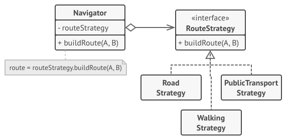
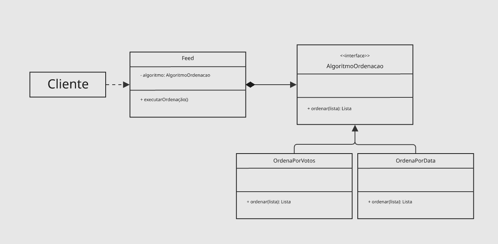
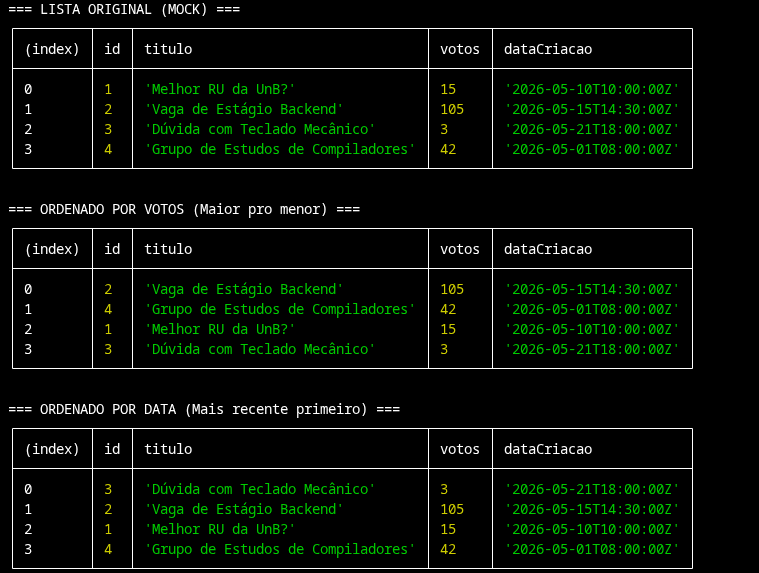

# Strategy Padrão Comportamental GoF

O **Strategy** é um padrão de projeto comportamental documentado pela Gang of Four (GoF). Ele tem como objetivo principal definir uma família de algoritmos, encapsular cada um deles e torná-los intercambiáveis. O Strategy permite que o algoritmo varie independentemente dos clientes que o utilizam.

Em termos práticos, em vez de implementar diferentes variações de um comportamento dentro de uma mesma classe (o que geralmente resulta em blocos enormes de `if/else` ou `switch/case`), esse padrão extrai esses comportamentos para classes separadas, chamadas de *estratégias*. A classe original (o *Contexto*) apenas guarda uma referência para uma interface de estratégia e delega a execução do trabalho para o objeto concreto associado.

## Quando usar o Strategy

O Strategy é recomendado nas seguintes situações:

<div align="center">



<font size="3">
<p>Fonte: <a href="https://refactoring.guru/pt-br/design-patterns/behavioral-patterns" target="_blank">Refactoring Guru</a>, Padrões de projeto comportamentais.</p>
</font>

</div>

* Quando você tem muitas classes parecidas que diferem apenas na forma como executam algum comportamento.
* Quando você precisa utilizar diferentes variantes de um algoritmo e deseja poder alternar entre elas em tempo de execução.
* Quando você quer isolar a lógica de negócios, ou regras complexas, dos detalhes de implementação do algoritmo (separação de responsabilidades).
* Quando sua classe possui uma instrução condicional massiva que escolhe entre diferentes comportamentos (evitando violações do princípio Aberto/Fechado - OCP).

## Estrutura do padrão

O Strategy envolve os seguintes participantes:

* **Context (Contexto)**: Mantém uma referência para uma das estratégias concretas e se comunica com esse objeto através da interface da estratégia.
* **Strategy (Estratégia)**: A interface comum para todas as estratégias concretas. Ela declara um método que o contexto usa para executar o algoritmo.
* **ConcreteStrategy (Estratégia Concreta)**: Implementa diferentes variações do algoritmo definido na interface base.
* **Client (Cliente)**: Cria um objeto de estratégia específica e o passa para o contexto.

---

# TenhoUmaDica - Modelagem e Implementação

No contexto da nossa plataforma acadêmica focada em conectar os estudantes da Universidade de Brasília, facilitando o compartilhamento de dicas de disciplinas, materiais de estudo e avaliações a ordenação do feed é uma funcionalidade crítica. Os alunos de diferentes campi (como FGA, Darcy Ribeiro, etc.) possuem necessidades de visualização distintas: às vezes precisam ver os materiais mais recentes adicionados nas vésperas de prova, e outras vezes precisam dos conteúdos mais bem avaliados (com mais votos) para estudar por um material de qualidade comprovada.

O padrão Strategy foi aplicado para flexibilizar e desacoplar a lógica de ordenação das postagens do **Feed**, permitindo que o usuário altere a visualização dinamicamente sem que o núcleo do sistema sofra alterações.

### Diagrama

O diagrama abaixo ilustra a aplicação do padrão Strategy na estruturação do Feed da plataforma:

<div align="center">

<iframe width="768" height="496" src="https://miro.com/app/live-embed/uXjVMmI8EgA=/?focusWidget=3458764671399992482&embedMode=view_only_without_ui&embedId=19172391265" frameborder="0" scrolling="no" allow="fullscreen; clipboard-read; clipboard-write" allowfullscreen></iframe>



<font size="3">
<p>Fonte: <a href="https://refactoring.guru/pt-br/design-patterns/behavioral-patterns" target="_blank">Refactoring Guru</a>, Padrões de projeto comportamentais.</p>
</font>

</div>

A arquitetura foi definida com os seguintes componentes:

* `Feed` **(Contexto)**: Representa o gerenciador da linha do tempo do usuário. Ele possui um atributo `- algoritmo: AlgoritmoOrdenacao` que guarda a referência da estratégia atual. Quando o cliente solicita a visualização, o Feed chama o método `+ executarOrdenacao()`, que por sua vez delega o trabalho para a estratégia injetada.
* `AlgoritmoOrdenacao` **(Strategy / Interface)**: Define o contrato para todos os algoritmos de ordenação suportados. Possui o método `+ ordenar(lista): Lista`, garantindo que qualquer nova forma de ordenação no futuro respeite essa assinatura.
* **Estratégias Concretas (ConcreteStrategies)**:
* `OrdenaPorVotos`: Implementa a ordenação baseada na popularidade da postagem (quantidade de curtidas ou avaliações positivas). Ideal para encontrar os melhores resumos ou listas de exercícios.
* `OrdenaPorData`: Implementa a ordenação cronológica (do mais recente para o mais antigo). Essencial para acompanhar anúncios de monitores, avisos de professores ou discussões recentes.


### Como o Strategy atua no Fórum

O fluxo de funcionamento do algoritmo de ordenação ocorre da seguinte forma:

1. O `Cliente` (a interface de usuário no front-end ou o controlador) decide qual o critério de visualização desejado pelo aluno (ex: clique no botão "Mais Populares").
2. O sistema instancializa a classe concreta correspondente, neste caso, `OrdenaPorVotos`.
3. O objeto instanciado é injetado no `Feed` (via construtor ou por um método *setter*, como `setAlgoritmo()`).
4. Quando o sistema precisa renderizar os posts, ele invoca `feed.executarOrdenacao()`.
5. O `Feed` desconhece os detalhes (se está ordenando por Quicksort, MergeSort, acessando atributos X ou Y). Ele apenas confia no polimorfismo e recebe a `Lista` já devidamente organizada para exibição.

### Vantagens do Strategy no contexto do TenhoUmaDica

* **Substituição em Tempo de Execução:** O aluno pode alternar entre "Ver mais recentes" e "Ver mais votados" instantaneamente, e o sistema apenas troca o objeto de estratégia em memória.
* **Adesão ao Open/Closed Principle (OCP):** Se amanhã decidirmos implementar uma `OrdenaPorRelevanciaDaDisciplina` (priorizando posts de matérias que o aluno está cursando no semestre atual), basta criar uma nova classe que implementa `AlgoritmoOrdenacao`. A classe `Feed` permanecerá intocada.
* **Testabilidade:** Como aplicamos a Injeção de Dependência, é extremamente simples testar a ordenação isoladamente em testes unitários ou criar estratégias simuladas (*Mocks*) para testar o comportamento do `Feed`.

## Implementação - Strategy

### 1. Interface (`AlgoritmoOrdenacao.ts`)

```typescript
export interface TopicoFeed {
  id?: string | number;
  votos: number;
  dataCriacao: Date | string | number;
  [key: string]: any; 
}

export interface AlgoritmoOrdenacao {
  ordenar(lista: TopicoFeed[]): TopicoFeed[];
}
```

### 2. Estratégia de Ordenação por Votos (`OrdenaPorVotos.ts`)

```typescript
import { AlgoritmoOrdenacao, TopicoFeed } from './algoritmo-ordenacao.interface';

export class OrdenaPorVotos implements AlgoritmoOrdenacao {
  
  ordenar(lista: TopicoFeed[]): TopicoFeed[] {
    return lista.sort((a, b) => b.votos - a.votos);
  }

}
```

### 3. Estratégia de Ordenação por Data (`OrdenaPorData.ts`)

```typescript
import { AlgoritmoOrdenacao, TopicoFeed } from './algoritmo-ordenacao.interface';

export class OrdenaPorData implements AlgoritmoOrdenacao {
  
  ordenar(lista: TopicoFeed[]): TopicoFeed[] {
    return lista.sort((a, b) => {
      const tempoA = new Date(a.dataCriacao).getTime();
      const tempoB = new Date(b.dataCriacao).getTime();
      return tempoB - tempoA;
    });
  }

}
```


### 🧪 Script de Validação e Testes dos Algoritmos

Abaixo está a implementação do script de teste que utiliza dados simulados (*mocks*) para validar o comportamento e a eficiência das estratégias de ordenação por votos e por data.

```typescript
import { TopicoFeed } from './algoritmo-ordenacao.interface';
import { OrdenaPorVotos } from './ordena-por-votos.strategy';
import { OrdenaPorData } from './ordena-por-data.strategy';

// 1. Criando os dados simulados (Mocks) totalmente desordenados
const mockTopicos: TopicoFeed[] = [
  { id: 1, titulo: 'Melhor RU da UnB?', votos: 15, dataCriacao: '2026-05-10T10:00:00Z' },
  { id: 2, titulo: 'Vaga de Estágio Backend', votos: 105, dataCriacao: '2026-05-15T14:30:00Z' }, // Mais Votado
  { id: 3, titulo: 'Dúvida com Teclado Mecânico', votos: 3, dataCriacao: '2026-05-21T18:00:00Z' }, // Mais Recente
  { id: 4, titulo: 'Grupo de Estudos de Compiladores', votos: 42, dataCriacao: '2026-05-01T08:00:00Z' }, // Mais Antigo
];

// Instanciando as estratégias
const ordenadorVotos = new OrdenaPorVotos();
const ordenadorData = new OrdenaPorData();

console.log('=== 📋 LISTA ORIGINAL (MOCK) ===');
console.table(mockTopicos, ['id', 'titulo', 'votos', 'dataCriacao']);

// 2. Testando a ordenação por Votos (Clone do array para não mutar o original)
const ordenadoPorVotos = ordenadorVotos.ordenar([...mockTopicos]);
console.log('\n=== 🔥 ORDENADO POR VOTOS (Maior pro menor) ===');
console.table(ordenadoPorVotos, ['id', 'titulo', 'votos', 'dataCriacao']);

// 3. Testando a ordenação por Data
const ordenadoPorData = ordenadorData.ordenar([...mockTopicos]);
console.log('\n=== ⏰ ORDENADO POR DATA (Mais recente primeiro) ===');
console.table(ordenadoPorData, ['id', 'titulo', 'votos', 'dataCriacao']);
```

<div align="center">


<font size="3">
<p style="text-align: center">Fonte: 
    <a href="[João Gabriel](https://github.com/JoaoComTil)" target="_blank">João Gabriel
    </a>
</p></font>

</div>
---

# Referências

1. **MÓDULO DE PADRÕES DE PROJETO COMPORTAMENTAIS**. *Slides da professora*. Disponível em Aprender3. Acesso em: 21/05/2026.
2. **REFACTORING GURU**. *Padrões de Projeto Comportamentais*. Disponível em: [https://refactoring.guru/pt-br/design-patterns/behavioral-patterns](https://www.google.com/search?q=https://refactoring.guru/pt-br/design-patterns/behavioral-patterns). Acesso em: 21/05/2026.

---

# Histórico de versão

| Versão | Descrição | Autor(es) | Data |
| --- | --- | --- | --- |
| 1.0 | Versão inicial, Modelagem e Documentação do Strategy | [Diogo Oliveira](https://github.com/Diogo-Olivv) | 21/05/2026 |
| 1.1 | Implementação código + correções pontuais | [João Gabriel](https://github.com/JoaoComTil) | 21/05/2026 |