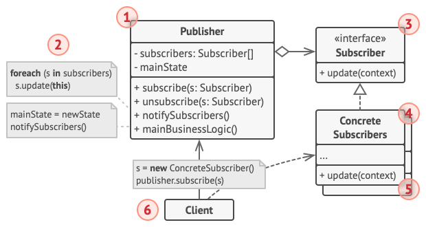
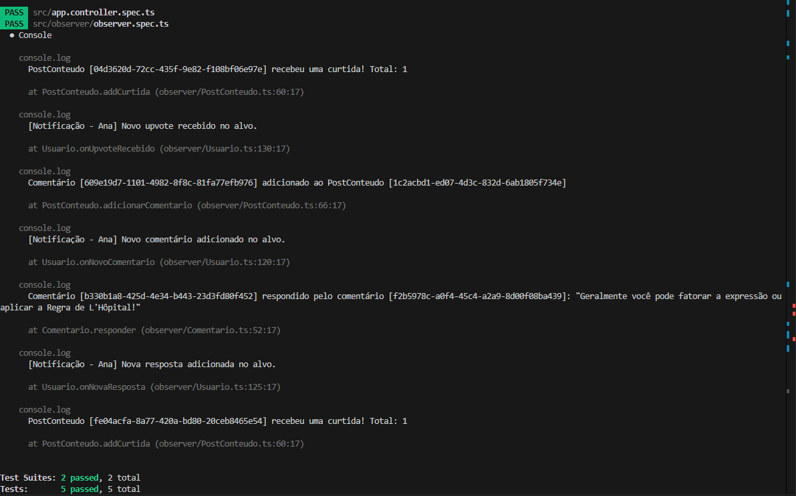
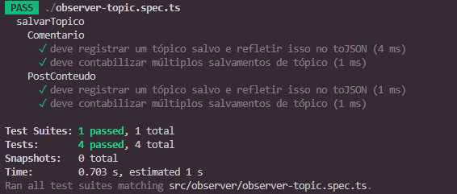

# 3.3.2. Observer

## Contextualização do GoF comportamental Observer

O padrão **Observer** é um dos padrões comportamentais do catálogo GoF (*Gang of Four*). Seu objetivo é definir uma dependência de um para muitos entre objetos, de modo que, quando um objeto central muda de estado, todos os seus dependentes sejam notificados automaticamente.

Esse padrão é útil quando o sistema precisa reagir a eventos sem criar acoplamento forte entre quem produz o evento e quem consome a atualização. Em vez de uma classe conhecer diretamente todas as outras que precisam ser avisadas, ela apenas publica a mudança e os observadores interessados respondem a ela.

No contexto do **TenhoUmaDica**, esse comportamento é importante porque a plataforma trabalha com interações em tempo real entre usuários, comentários, tópicos, conteúdos, avaliações e notificações. Quando um post recebe uma interação, quando um comentário é criado ou quando um conteúdo sofre alteração relevante, o sistema precisa refletir isso para outros módulos sem espalhar chamadas diretas por toda a aplicação.

---

## Quando usar

<div align="center">



<font size="3">
<p>Fonte: <a href="https://refactoring.guru/pt-br/design-patterns/behavioral-patterns" target="_blank">Refactoring Guru</a>, Padrões de projeto comportamentais.</p>
</font>

</div>

O Observer deve ser usado quando:

- um objeto altera seu estado e precisa avisar várias partes do sistema;
- há necessidade de desacoplamento entre quem emite a mudança e quem reage a ela;
- múltiplas telas, serviços ou componentes precisam acompanhar o mesmo evento;
- o número de interessados na atualização pode mudar ao longo do tempo;
- o sistema precisa suportar notificações automáticas, feeds dinâmicos ou atualização de indicadores.

No **TenhoUmaDica**, isso se aplica especialmente a:

- notificações de comentários, respostas e votos;
- atualização de contadores de curtidas e interações;
- propagação de eventos de publicação em tópicos, conteúdos e avaliações;
- atualização de badges, reputação e indicadores de atividade;
- sincronização da interface com o estado atual das publicações.

---

## Estrutura do padrão no TenhoUmaDica

No projeto, o Observer pode ser entendido a partir dos seguintes papéis:

- **Notificável**: contrato que define a capacidade de aceitar observadores, removê-los e notificar todos quando algo muda;
- **Observer**: contrato que define a reação a um evento;
- **PostConteudo** e **Comentario**: entidades que representam eventos observáveis, pois podem sofrer alterações e gerar notificações;
- **Usuario**: entidade interessada nas mudanças, atuando como observador de conteúdos, comentários ou tópicos;
- **TipoEvento**: informa qual mudança aconteceu e ajuda a decidir qual reação executar.

Essa estrutura permite que o sistema faça a comunicação entre objetos sem que uma classe precise conhecer detalhes internos da outra.

---

## Diagrama

Foi elaborado um diagrama com a aplicação do Observer da seguinte forma:

.jpg)

**Fonte:** Felipe Rodrigues 

<iframe width="768" height="496" src="https://miro.com/app/board/uXjVMmI8EgA=/?moveToWidget=3458764671399992497&cot=14" frameborder="0" scrolling="no" allow="fullscreen; clipboard-read; clipboard-write" allowfullscreen></iframe>

---

## Diagrama e explicação detalhada

O diagrama apresentado no módulo mostra a estrutura básica do Observer aplicada ao domínio do TenhoUmaDica.

### 1. Interface `Notificavel`

A interface `Notificavel` representa a origem dos eventos. Ela define operações como:

- adicionar observadores;
- remover observadores;
- notificar observadores.

Na prática, ela atua como o contrato que qualquer entidade observável deve seguir. Isso significa que qualquer classe que represente uma publicação, tópico, comentário ou conteúdo pode emitir eventos sem expor sua implementação interna.

### 2. Interface `Observer`

A interface `Observer` define o comportamento de quem recebe notificações. Em vez de a classe origem chamar métodos específicos de cada dependente, ela apenas dispara o evento e cada observador decide o que fazer.

No projeto, essa interface representa usuários, módulos de notificação, painéis de atividade ou componentes da interface que precisam reagir quando algo muda.

### 3. Classe `Comentario`

A classe `Comentario` aparece no diagrama como uma implementação de `Notificavel`. Ela contém dados como:

- id do comentário;
- texto;
- data de criação;
- contador de curtidas.

Quando um comentário recebe uma alteração relevante, como nova resposta ou nova reação, ele pode notificar os observadores cadastrados. Isso permite, por exemplo, atualizar a thread sem recarregar toda a estrutura da página.

### 4. Classe `PostConteudo`

A classe `PostConteudo` também implementa `Notificavel`. Ela representa publicações mais completas, como materiais, discussões e conteúdos acadêmicos.

No diagrama, ela possui atributos como:

- id;
- texto;
- descrição;
- data de criação;
- contador de curtidas.

Ela funciona como o centro de emissão dos eventos. Quando um conteúdo recebe curtida, comentário, edição ou denúncia, a classe dispara a atualização para os observadores registrados.

### 5. Classe `Usuario`

A classe `Usuario` implementa `Observer` e também centraliza informações acadêmicas e de perfil. Ela possui atributos como:

- id;
- foto;
- nome;
- email;
- senha;
- semestre;
- data de cadastro;
- disciplinas;
- conteúdos favoritos;
- tópicos ou postagens acompanhadas.

Além de armazenar dados, o usuário também pode reagir a eventos do sistema. Por isso, ele é o principal consumidor das atualizações geradas por posts e comentários.

### 6. Como as classes conversam entre si

O funcionamento segue esta lógica:

1. um `Usuario` cria ou acompanha uma `PostConteudo` ou um `Comentario`;
2. a entidade observável registra os observadores interessados;
3. quando ocorre uma mudança, a entidade chama `notificarObservadores`;
4. cada `Observer` recebe o evento e executa sua lógica;
5. a interface pode atualizar contadores, mensagens, alertas ou a thread exibida.

Isso evita dependências diretas entre as classes e mantém o fluxo de atualização organizado.

### 7. Como isso faz o sistema funcionar

O Observer dá suporte a um comportamento central do TenhoUmaDica: a plataforma é colaborativa e depende de eventos gerados por usuários.

Sem esse padrão, cada funcionalidade precisaria conhecer manualmente quem deve ser avisado. Com o Observer, o sistema passa a reagir aos eventos de forma automática, o que facilita:

- notificar o autor de um post;
- atualizar o número de curtidas;
- refletir respostas em uma thread;
- mostrar alertas na área do usuário;
- manter a interface coerente com o estado atual do fórum.

### 8. Relação com o backlog

A modelagem do Observer conversa diretamente com várias histórias do backlog:

- **US 2.3 - Upvote/Downvote e Comentários**: curtidas e comentários são eventos que alteram o estado do post e podem notificar interessados;
- **US 5.1 - Denunciar Conteúdo**: denúncias geram eventos para moderação;
- **US 6.1 - Visualização de Perfil**: o perfil pode ser atualizado a partir de interações recebidas;
- **US 8.5 - Visualização de Conteúdo**: conteúdos exibem recursos e interações em tempo real;
- **US 9.2 - Responder Comentários**: respostas encadeadas dependem de atualização automática da thread;
- **US 9.3 - Favoritar Publicações**: favoritos podem acionar notificações e contadores;
- **US 10.1 - Avaliação de Disciplina**: avaliações precisam refletir novas notas e comentários;
- **US 10.3 - Interação com Avaliações**: votos e favoritos em avaliações também podem gerar notificações;
- **US 12.1 - Notificação de Interações**: é o caso mais direto de uso do Observer, pois cada interação relevante dispara uma notificação;
- **US 13.1 - Cálculo de Reputação**: interações recebidas podem alimentar regras de reputação;
- **US 14.1 - Revisão de Conteúdos Denunciados**: denúncias podem ser propagadas automaticamente para moderação.

### 9. Leitura do diagrama dentro do domínio do projeto

O diagrama mostra que a plataforma não trata comentários, conteúdos e usuários como partes isoladas. Eles formam uma rede de eventos.

Em um cenário real do TenhoUmaDica:

- um usuário publica um conteúdo;
- outros usuários acompanham esse conteúdo;
- quando há curtida, comentário ou denúncia, os observadores são notificados;
- a interface atualiza o feed, o perfil e os indicadores;
- o autor recebe feedback da interação.

Essa leitura ajuda a justificar o uso do padrão porque o sistema não se resume a CRUDs. Ele precisa refletir comportamento colaborativo e atualização orientada a eventos.

---

## Modelagem e implementação

Na modelagem do TenhoUmaDica, o Observer foi pensado para representar eventos da plataforma de maneira desacoplada.

### Modelagem

- as entidades que publicam eventos seguem a interface `Notificavel`;
- os interessados seguem a interface `Observer`;
- eventos relevantes são disparados quando ocorre alteração de estado;
- a atualização não depende de chamadas diretas entre todos os componentes.

### Implementação

Na implementação, a estrutura pode ser aplicada tanto no backend quanto no frontend:

- no backend, para disparar notificações, logs, reputação e atualização de estado;
- no frontend, para atualizar cards, badges, lista de comentários e alertas visuais;
- na integração entre camadas, para refletir mudanças vindas de novos posts, votos e denúncias.

Mesmo em uma implementação simplificada, o importante é manter a ideia principal: quem gera o evento não precisa conhecer todos os receptores.

### Pontos de vista aplicados na modelagem

Alguns pontos de vista do diagrama e da implementação, elaborados por **Felipe Rodrigues**, ajudam a justificar a escolha do Observer no TenhoUmaDica:

1. **Observers como interface e não como classe abstrata**

	Os observers foram modelados como interface para reduzir dependência de herança e manter o desenho mais flexível. Isso evita problemas de acoplamento e permite que diferentes classes assumam o papel de observador sem impor uma hierarquia rígida. Na prática, isso é útil quando o projeto precisa crescer e novos tipos de observadores surgem sem alterar a estrutura principal.

2. **Métodos descritivos para reduzir tráfego de dados**

	Os métodos do Observer devem ser nomeados de forma clara e objetiva, como `onNovoComentario(alvo: Any)`, para indicar exatamente qual evento está sendo tratado. Esse estilo melhora a leitura do código e evita enviar dados desnecessários entre objetos, porque a assinatura do método já comunica o que o observador precisa receber para reagir ao evento.

3. **Passagem da instância do alvo por parâmetro**

	Diferente de exemplos mais simples, a instância do alvo é enviada diretamente para o observador quando o evento ocorre. Isso elimina a necessidade de o observador fazer uma nova requisição para descobrir o estado atualizado do objeto. Com isso, a notificação fica mais eficiente, o fluxo de dados fica mais explícito e o sistema evita chamadas extras apenas para recuperar informação que já está disponível no momento do evento.


---
## Código-Fonte da Implementação

### 1. TipoEvento.ts
```typescript
export enum TipoEvento {
    NOVO_COMENTARIO = 'NOVO_COMENTARIO',
    NOVA_RESPOSTA = 'NOVA_RESPOSTA',
    UPVOTE = 'UPVOTE',
}

```

### 2. Observer.ts

```typescript
export interface Observer {
    onNovoComentario(alvo: any): void;
    onNovaResposta(alvo: any): void;
    onUpvoteRecebido(alvo: any): void;
}

```

### 3. Notificavel.ts

```typescript
import { Observer } from './Observer';
import { TipoEvento } from './TipoEvento';

export interface Notificavel {
    adicionarObservador(obs: Observer): void;
    removerObservador(obs: Observer): void;
    notificarObservadores(evento: TipoEvento): void;
}

```

### 4. PostConteudo.ts

```typescript
import { Notificavel } from './Notificavel';
import { Observer } from './Observer';
import { TipoEvento } from './TipoEvento';
import { Comentario } from './Comentario';
import { randomUUID } from 'crypto';

export class PostConteudo implements Notificavel {
    private id: string;
    private texto: string;
    private descricao: string;
    private dataCriacao: Date;
    private contadorCurtidas: number;
    private observadores: Observer[] = [];
    private comentarios: Comentario[] = [];

    constructor(texto: string, descricao: string) {
        this.id = randomUUID();
        this.texto = texto;
        this.descricao = descricao;
        this.dataCriacao = new Date();
        this.contadorCurtidas = 0;
    }

    public getId(): string {
        return this.id;
    }

    public getTexto(): string {
        return this.texto;
    }

    public getDescricao(): string {
        return this.descricao;
    }

    public getContadorCurtidas(): number {
        return this.contadorCurtidas;
    }

    public getComentarios(): Comentario[] {
        return this.comentarios;
    }

    public postar(): void {
        console.log(`PostConteudo [${this.id}] postado: "${this.texto}" - ${this.descricao}`);
    }

    public editar(novoTexto: string, novaDescricao?: string): void {
        this.texto = novoTexto;
        if (novaDescricao) this.descricao = novaDescricao;
        console.log(`PostConteudo [${this.id}] editado: "${this.texto}" - ${this.descricao}`);
    }

    public delete(): void {
        console.log(`PostConteudo [${this.id}] deletado.`);
    }

    public addCurtida(): void {
        this.contadorCurtidas++;
        console.log(`PostConteudo [${this.id}] recebeu uma curtida! Total: ${this.contadorCurtidas}`);
        this.notificarObservadores(TipoEvento.UPVOTE);
    }

    public adicionarComentario(comentario: Comentario): void {
        this.comentarios.push(comentario);
        console.log(`Comentário [${comentario.getId()}] adicionado ao PostConteudo [${this.id}]`);
        this.notificarObservadores(TipoEvento.NOVO_COMENTARIO);
    }

    // Métodos da interface Notificavel
    public adicionarObservador(obs: Observer): void {
        if (!this.observadores.includes(obs)) {
            this.observadores.push(obs);
        }
    }

    public removerObservador(obs: Observer): void {
        const index = this.observadores.indexOf(obs);
        if (index !== -1) {
            this.observadores.splice(index, 1);
        }
    }

    public notificarObservadores(evento: TipoEvento): void {
        for (const obs of this.observadores) {
            switch (evento) {
                case TipoEvento.NOVO_COMENTARIO:
                    const ultimoComentario = this.comentarios[this.comentarios.length - 1];
                    obs.onNovoComentario(ultimoComentario || this);
                    break;
                case TipoEvento.NOVA_RESPOSTA:
                    obs.onNovaResposta(this);
                    break;
                case TipoEvento.UPVOTE:
                    obs.onUpvoteRecebido(this);
                    break;
            }
        }
    }
}

```

### 5. Comentario.ts

```typescript
import { Notificavel } from './Notificavel';
import { Observer } from './Observer';
import { TipoEvento } from './TipoEvento';
import { randomUUID } from 'crypto';

export class Comentario implements Notificavel {
    private id: string;
    private texto: string;
    private dataCriacao: Date;
    private contadorCurtidas: number;
    private observadores: Observer[] = [];

    constructor(texto: string) {
        this.id = randomUUID();
        this.texto = texto;
        this.dataCriacao = new Date();
        this.contadorCurtidas = 0;
    }

    public getId(): string {
        return this.id;
    }

    public getTexto(): string {
        return this.texto;
    }

    public getContadorCurtidas(): number {
        return this.contadorCurtidas;
    }

    public postar(): void {
        console.log(`Comentário [${this.id}] postado: "${this.texto}"`);
    }

    public editar(novoTexto: string): void {
        this.texto = novoTexto;
        console.log(`Comentário [${this.id}] editado: "${this.texto}"`);
    }

    public deletar(): void {
        console.log(`Comentário [${this.id}] deletado.`);
    }

    public addCurtida(): void {
        this.contadorCurtidas++;
        console.log(`Comentário [${this.id}] recebeu uma curtida! Total: ${this.contadorCurtidas}`);
        this.notificarObservadores(TipoEvento.UPVOTE);
    }

    public responder(comentario: Comentario): void {
        console.log(`Comentário [${this.id}] respondido pelo comentário [${comentario.getId()}]: "${comentario.getTexto()}"`);
        this.notificarObservadores(TipoEvento.NOVA_RESPOSTA);
    }

    // Métodos da interface Notificavel
    public adicionarObservador(obs: Observer): void {
        if (!this.observadores.includes(obs)) {
            this.observadores.push(obs);
        }
    }

    public removerObservador(obs: Observer): void {
        const index = this.observadores.indexOf(obs);
        if (index !== -1) {
            this.observadores.splice(index, 1);
        }
    }

    public notificarObservadores(evento: TipoEvento): void {
        for (const obs of this.observadores) {
            switch (evento) {
                case TipoEvento.NOVO_COMENTARIO:
                    obs.onNovoComentario(this);
                    break;
                case TipoEvento.NOVA_RESPOSTA:
                    obs.onNovaResposta(this);
                    break;
                case TipoEvento.UPVOTE:
                    obs.onUpvoteRecebido(this);
                    break;
            }
        }
    }
}

```

### 6. Usuario.ts

```typescript
import { Observer } from './Observer';
import { PostConteudo } from './PostConteudo';
import { Comentario } from './Comentario';
import { randomUUID } from 'crypto';

export interface Disciplina {
    id: string;
    nome: string;
}

export interface TopicoForum {
    id: string;
    titulo: string;
}

export class Usuario implements Observer {
    private id: string;
    private foto: string;
    private nome: string;
    private email: string;
    private senha: string;
    private bio: string;
    private dataCadastro: Date;
    private disciplinasSalvas: Disciplina[] = [];
    private topicosSalvos: TopicoForum[] = [];
    private conteudoSalvo: PostConteudo[] = [];
    
    // Auxiliar para fins de testes unitários e validações em memória
    public notificacoesRecebidas: Array<{ tipo: string; alvo: any }> = [];

    constructor(nome: string, email: string, foto: string = 'default.png', bio: string = '') {
        this.id = randomUUID();
        this.nome = nome;
        this.email = email;
        this.foto = foto;
        this.senha = 'senha123';
        this.bio = bio;
        this.dataCadastro = new Date();
    }

    public getId(): string {
        return this.id;
    }

    public getNome(): string {
        return this.nome;
    }

    public getEmail(): string {
        return this.email;
    }

    public getFoto(): string {
        return this.foto;
    }

    public bioEModificada(novaBio: string): void {
        this.bio = novaBio;
        console.log(`Bio do usuário [${this.nome}] atualizada.`);
    }

    public autenticar(): boolean {
        console.log(`Usuário [${this.nome}] autenticado com sucesso.`);
        return true;
    }

    public alterationSenha(novaSenha: string): void {
        this.senha = novaSenha;
        console.log(`Senha do usuário [${this.nome}] alterada.`);
    }

    public salvarDisciplina(disciplina: Disciplina): void {
        if (!this.disciplinasSalvas.includes(disciplina)) {
            this.disciplinasSalvas.push(disciplina);
            console.log(`Usuário [${this.nome}] salvou a disciplina \"${disciplina.nome}\".`);
        }
    }

    public salvarTopicoForum(topico: TopicoForum): void {
        if (!this.topicosSalvos.includes(topico)) {
            this.topicosSalvos.push(topico);
            console.log(`Usuário [${this.nome}] salvou o tópico \"${topico.titulo}\".`);
        }
    }

    public salvarPostConteudo(post: PostConteudo): void {
        if (!this.conteudoSalvo.includes(post)) {
            this.conteudoSalvo.push(post);
            console.log(`Usuário [${this.nome}] salvou o post \"${post.getTexto()}\".`);
        }
    }

    public curtirComentario(comentario: Comentario): void {
        console.log(`Usuário [${this.nome}] curtiu o comentário [${comentario.getId()}].`);
        comentario.addCurtida();
    }

    public curtirPostConteudo(post: PostConteudo): void {
        console.log(`Usuário [${this.nome}] curtiu o post [${post.getId()}].`);
        post.addCurtida();
    }

    // Métodos da interface Observer (Modelo Push)
    public onNovoComentario(alvo: any): void {
        console.log(`[Notificação - ${this.nome}] Novo comentário adicionado no alvo.`);
        this.notificacoesRecebidas.push({ tipo: 'NOVO_COMENTARIO', alvo });
    }

    public onNovaResposta(alvo: any): void {
        console.log(`[Notificação - ${this.nome}] Nova resposta adicionada no alvo.`);
        this.notificacoesRecebidas.push({ tipo: 'NOVA_RESPOSTA', alvo });
    }

    public onUpvoteRecebido(alvo: any): void {
        console.log(`[Notificação - ${this.nome}] Novo upvote recebido no alvo.`);
        this.notificacoesRecebidas.push({ tipo: 'UPVOTE', alvo });
    }
}

```

### 7. (Testes Unitários)




---

## Referências

GAMMA, Erich; HELM, Richard; JOHNSON, Ralph; VLISSIDES, John. *Design Patterns: Elements of Reusable Object-Oriented Software*. Addison-Wesley, 1994.

REFACTORING GURU. Observer. Disponível em: [https://refactoring.guru/pt-br/design-patterns/observer](https://refactoring.guru/pt-br/design-patterns/observer). Acesso em: 21 maio 2026.

REFACTORING GURU. Padrões de Projeto Comportamentais. Disponível em: [https://refactoring.guru/pt-br/design-patterns/behavioral-patterns](https://refactoring.guru/pt-br/design-patterns/behavioral-patterns). Acesso em: 21 maio 2026.

MÓDULO 3 - PADRÕES DE PROJETO. Diagrama do Observer e modelagem do TenhoUmaDica. Universidade de Brasília.

Backlog do Produto (MVP) do projeto TenhoUmaDica, seção de requisitos funcionais e não funcionais.

---

## Histórico de versão

| Versão | Descrição | Autor(es) | Data |
| --- | --- | --- | --- |
| 1.0 | Criação da documentação do Observer com contexto do TenhoUmaDica, explicação do diagrama e relação com o backlog. | Brenda Silva | 21/05/2026 |
| 1.1 | Revisão e adição de figuras. | Gabriel Araújo | 21/05/2026 |
| 1.2 | Adição dos códigos-fonte  (`Notificavel`, `Observer`, `TipoEvento`, `PostConteudo`, `Comentario`, `Usuario`) e suítes de testes automatizados com o modelo Push. | Renan Ribeiro | 22/05/2026 |
| 1.3 | Atualização da documentação com a implementação do Observer com `salvarTopico`. | Brenda Silva | 22/05/2026 |
