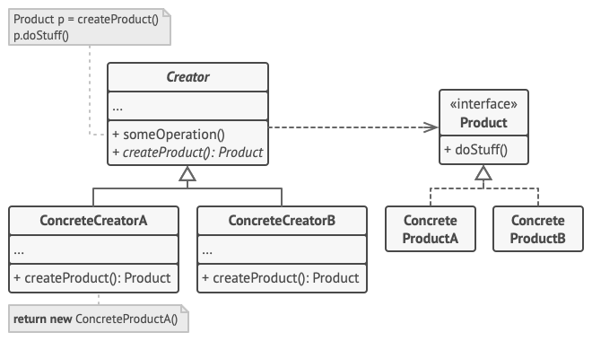
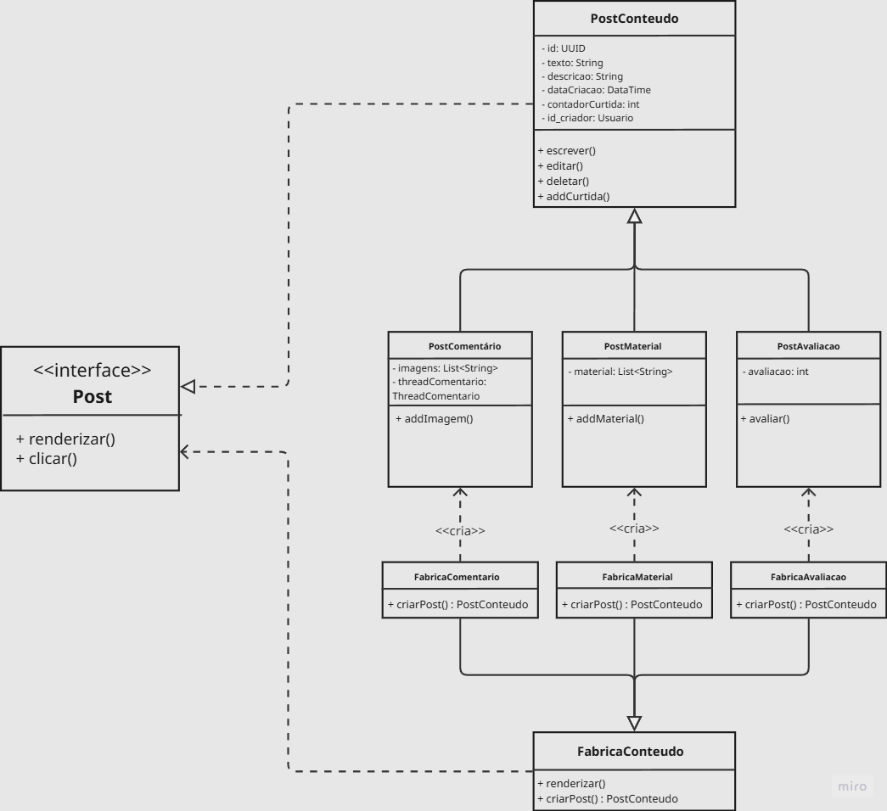

# Factory Method – Padrão Criacional GoF

O **Factory Method** é um dos padrões de projeto criacionais documentados pela Gang of Four (GoF). Ele tem como objetivo principal definir uma interface para criar um objeto, mas permitir que as subclasses decidam qual classe concreta instanciar. Em outras palavras, o Factory Method adia a instanciação para as subclasses, promovendo baixo acoplamento entre o código cliente e as classes dos produtos.

Esse padrão é especialmente útil quando uma classe não pode antecipar o tipo exato dos objetos que precisa criar, ou quando se deseja oferecer um ponto de extensão para que futuras variações sejam adicionadas sem modificar o código existente.

## Quando usar o Factory Method

O Factory Method é recomendado nas seguintes situações:

- Quando uma classe não conhece de antemão as classes concretas dos objetos que deve criar.
- Quando uma classe delega a responsabilidade de criação para suas subclasses, permitindo que elas escolham qual produto concreto instanciar.
- Quando se quer centralizar a lógica de criação em um único local, mas ainda assim permitir que subclasses alterem o tipo de objeto criado.
- Quando o sistema precisa ser extensível para novos tipos de produtos, sem violar o princípio Aberto/Fechado.

## Estrutura do padrão

O Factory Method envolve os seguintes participantes:

Fonte: <a href="https://refactoring.guru/pt-br/design-patterns/creational-patterns" target="_blank">Refactoring Guru</a>, Padrões de projeto criacionais.

- **Product (Produto)**: Define a interface comum para todos os objetos que o método fábrica vai criar.
- **ConcreteProduct (Produto Concreto)**: Implementa a interface Product.
- **Creator (Criador)**: Declara o factory method, que retorna um objeto do tipo Product. Pode também conter uma implementação padrão que retorna um produto concreto padrão.
- **ConcreteCreator (Criador Concreto)**: Sobrescreve o factory method para retornar uma instância de ConcreteProduct específico.

O código cliente depende apenas da interface Product e da classe Creator, não conhecendo as classes ConcreteProduct. A decisão de qual ConcreteProduct será instanciado fica encapsulada no ConcreteCreator.

---

# TenhoUmaDica - Modelagem e Implementação

No contexto do fórum acadêmico – uma plataforma estilo Reddit para universitários compartilharem dicas, materiais de estudo, avaliações de professores e outros conteúdos relacionados às disciplinas – o padrão Factory Method foi aplicado para centralizar e desacoplar a criação dos diferentes tipos de postagens. A ideia é que o núcleo do sistema (por exemplo, um TopicManager) não precise conhecer as classes concretas de cada post, bastando interagir com uma interface comum e delegar a criação a fábricas especializadas.

### Diagrama

Foi elaborado um diagrama no Miro com a aplicação do Factory Method da seguinte forma:

<iframe width="768" height="496" src="https://miro.com/app/live-embed/uXjVMmI8EgA=/?focusWidget=3458764671377925169&embedMode=view_only_without_ui&embedId=425005393769" frameborder="0" scrolling="no" allow="fullscreen; clipboard-read; clipboard-write" allowfullscreen></iframe>

Fonte: 
    <a href="https://github.com/Diogo-Olivv" target="_blank">Diogo
    </a>,
    <a href="https://github.com/GabrielMacielBR" target="_blank">Gabriel Maciel
    </a>,
    <a href="https://github.com/gabrielaugusto23" target="_blank">Gabriel Augusto
    </a> e
    <a href="https://github.com/Brwnds" target="_blank">Brenda
    </a>

A interface `Post` define o contrato que todos os tipos de postagem devem seguir, com métodos como `renderizar()` e `clicar()` . A partir dela, derivam-se classes concretas que representam as variações de post permitidas no fórum:

- `PostConteudo` – Representa um post genérico de conteúdo textual (como uma dica, uma pergunta ou um comentário comum). Ele possui os seguintes atributos: id, texto, descricao, dataCriacao, contadorCurtida, id_criador. E possúi os métodos: escrever(), editar(), deletar() e addCurtida().

- `PostMaterial` – Especialização para posts que compartilham materiais (listas de exercícios, slides, PDFs, links). Adiciona uma lista de arquivos (material) e o método addMaterial() para gerenciá‑los.

- `PostAvaliacao` – Destinada a posts de avaliação (feedback sobre disciplinas, professores ou métodos de ensino). Contém um atributo avaliacao (nota de 1 a 5, por exemplo) e o método avaliar(), que pode aplicar regras como impedir que um mesmo usuário avalie duas vezes o mesmo professor.

- `PostComentario` – Representa comentários aninhados em uma thread. Possui uma lista de imagens e uma referência à ThreadComentario, permitindo respostas hierárquicas.

- **Fábricas concretas (ConcreteCreator)**: `FabricaConteudo`, `FabricaComentario`, `FabricaMaterial`, `FabricaAvaliacao`. Cada uma implementa o método `criarPost(): PostConteudo` . Esse método é o **factory method** responsável por instanciar o tipo correspondente de postagem.

### Como o Factory Method atua no Fórum

O fluxo de criação de um novo post pode ser resumido em:

1. O usuário acessa a interface de criação e escolhe o tipo de postagem (ex.: “Compartilhar material”, “Fazer uma avaliação”).
2. A interface (cliente) não instancia diretamente as classes concretas. Em vez disso, ela utiliza uma fábrica apropriada. Por exemplo, se o usuário escolhe “Material”, o sistema instancia uma `FabricaMaterial`.
3. O código cliente chama o método `criarPost()` dessa fábrica. Esse método encapsula toda a lógica de construção e configuração do objeto `PostMaterial` (que implementa `Post`).
4. O cliente então utiliza o objeto retornado apenas por meio da interface `Post`, chamando `renderizar()` e `clicar()` sem conhecer detalhes da implementação concreta.

### Vantagens do Factory no contexto do TenhoUmaDica

- **Desacoplamento** – O código que gerencia tópicos não precisa conter if/else ou switch para instanciar o tipo correto de post. Basta usar a fábrica que lhe for fornecida.

- **Extensibilidade** – Para adicionar um novo tipo de post (como PostEnquete ou PostEvento), basta criar a nova classe de produto e sua respectiva fábrica concreta, sem alterar o TopicManager nem as outras fábricas.

- **Centralização de regras** – Validações específicas (tamanho de PDF, nota mínima/máxima, limites de caracteres) podem ser colocadas dentro de cada fábrica ou no construtor do produto, ficando isoladas do restante do sistema.

- **Facilidade de teste** – Durante os testes unitários, é possível substituir as fábricas reais por versões mock que retornam objetos de post pré‑configurados, sem necessidade de tocar no banco de dados ou em recursos externos.

- **Princípio de Responsabilidade Única (SRP)** - A lógica de instanciação e validação inicial de cada postagem (como checar os limites de arquivos de um `PostMaterial` ou a nota de um `PostAvaliacao`) fica contida estritamente dentro de sua respectiva fábrica. Isso remove do `TopicManager` a sobrecarga de saber *como construir* os objetos, deixando-o focado apenas em *gerenciar* o fluxo do fórum.

## Implementação - Factory Method
Códigos

---

# Referencias

1. **MÓDULO DE PADRÕES DE PROJETO CRIACIONAIS**. *Slides da professora*. Disponível em Aprender3: <https://aprender3.unb.br/mod/page/view.php?id=1523528>. Acesso em: 20/05/2026.
2. **REFACTORING GURU**. *Padrões de Projeto Criacionais*. Disponível em: <https://refactoring.guru/pt-br/design-patterns/creational-patterns>. Acesso em: 20/05/2026.

---
#  Histórico de versão

| Versão | Descrição | Autor(es) | Data |
| :----: | :--- | :--- | :---: |
| 1.0 | Versão inicial e Explicação do diagrama | [Marcos Bezerra](https://github.com/marcoslbz) | 20/05/2026 |
| 1.1 | Revisão e Correção | [João Gabriel](https://github.com/JoaoComTil) | 21/05/2026 |