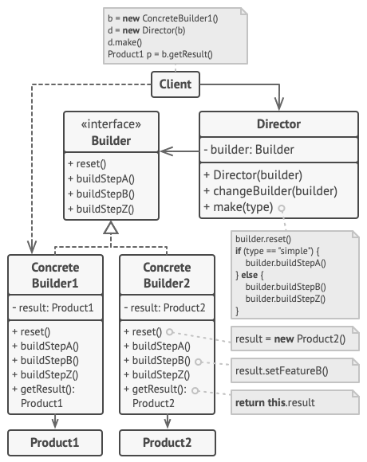
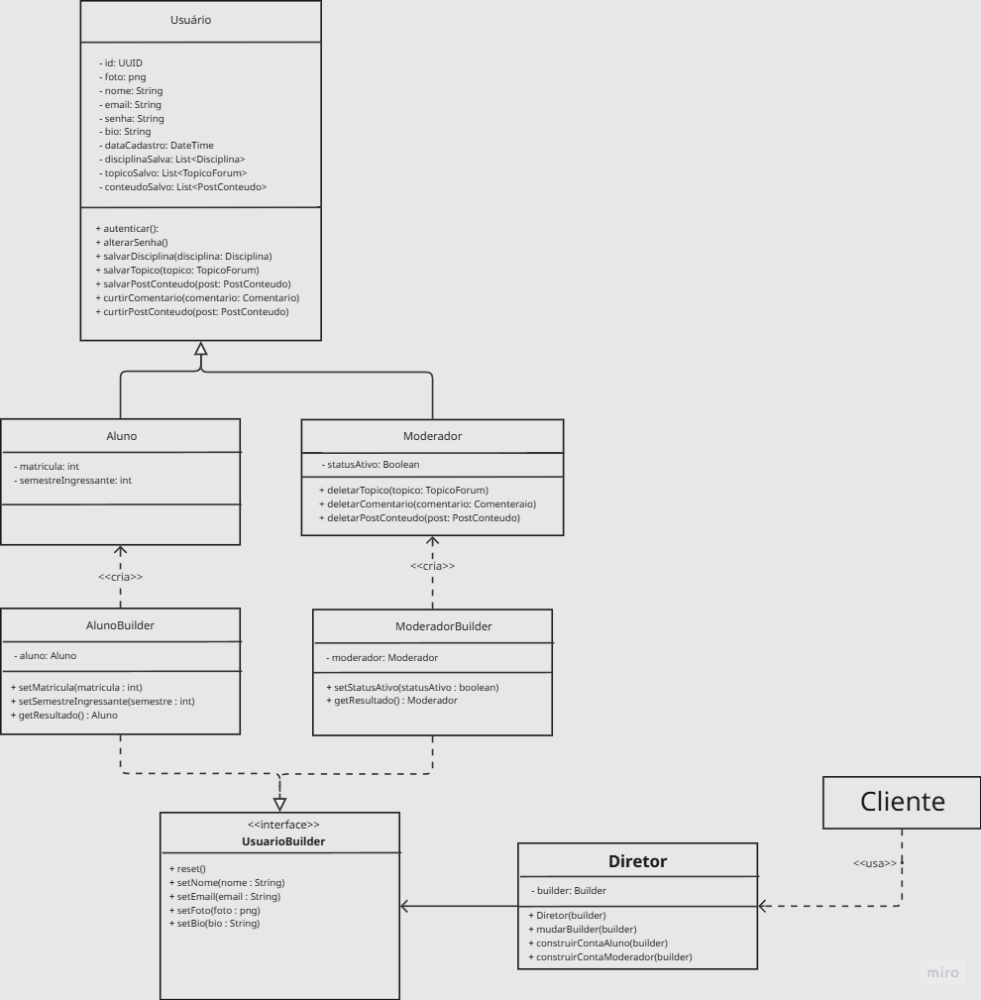

# Builder – Padrão Criacional GoF

O **Builder** é um padrão de projeto criacional que separa a construção de um objeto complexo da sua representação final. Em vez de utilizar um construtor com vários parâmetros (ou uma lista crescente de construtores sobrecarregados), o Builder permite construir o objeto passo a passo, através de métodos encadeados (fluent interface). Ao final, um método `build()` retorna a instância completamente configurada.

Esse padrão é especialmente útil quando um objeto possui muitos atributos opcionais, ou quando o processo de construção envolve várias etapas que podem ser combinadas de diferentes maneiras. Ele também ajuda a garantir a imutabilidade do objeto após a construção.

## Quando usar o Builder

O Builder é recomendado nas seguintes situações:

- Quando a criação de um objeto exige muitas etapas ou muitos parâmetros (principalmente opcionais), evitando construtores longos e difíceis de ler.
- Quando o mesmo processo de construção deve poder criar diferentes representações do objeto (ex.: um mesmo `PostBuilder` pode gerar posts completos ou apenas rascunhos).
- Quando você deseja isolar a lógica de construção de uma classe complexa, seguindo o princípio da responsabilidade única.
- Quando o objeto a ser construído precisa ser imutável (todos os atributos são definidos antes da criação).

## Estrutura do padrão

O Builder envolve os seguintes participantes:

Fonte: <a href="https://refactoring.guru/pt-br/design-patterns/builder" target="_blank">Refactoring Guru</a>, Builder.

- **Builder** – Interface ou classe abstrata que declara os métodos de construção para cada parte do produto.
- **ConcreteBuilder** – Implementa os métodos da interface `Builder` e mantém o objeto em construção. Fornece um método `getResult()` ou `build()` para retornar o produto final.
- **Product** – O objeto complexo que está sendo construído (ex.: `Post`, `Material`, `Avaliacao`).
- **Director** (opcional) – Classe que define a ordem em que os métodos de construção devem ser chamados para criar um produto padrão. O cliente pode usar o `Director` ou chamar os métodos do `Builder` diretamente.

O cliente depende apenas da interface `Builder` (ou da classe `Director`). A lógica de criação fica encapsulada no `ConcreteBuilder`, e o `Product` não precisa expor construtores complicados.

---

# TenhoUmaDica - Modelagem e Implementação

No sistema **TenhoUmaDica**, a entidade `Usuario` pode assumir dois papéis distintos: `Aluno`  e `Moderador`. Além disso, a criação de um usuário envolve diversos atributos opcionais (foto, bio, lista de disciplinas salvas, etc.) e etapas de configuração que podem variar conforme o tipo de perfil. Utilizar construtores com dezenas de parâmetros ou espalhar a lógica de criação pelo código resultaria em baixa legibilidade, duplicação e forte acoplamento.

O **padrão Builder** foi escolhido para resolver esse problema, permitindo a construção passo a passo de objetos `Usuario`, `Aluno` e `Moderador` de forma controlada e extensível.

### Diagrama

Foi elaborado um diagrama no Miro com a aplicação do padrão Builder da seguinte forma:

<iframe width="768" height="496" src="https://miro.com/app/live-embed/uXjVMmI8EgA=/?focusWidget=3458764671378058069&embedMode=view_only_without_ui&embedId=947708959990" frameborder="0" scrolling="no" allow="fullscreen; clipboard-read; clipboard-write" allowfullscreen></iframe>

Fonte: 
    <a href="https://github.com/Diogo-Olivv" target="_blank">Diogo
    </a>,
    <a href="https://github.com/GabrielMacielBR" target="_blank">Gabriel Maciel
    </a>,
    <a href="https://github.com/gabrielaugusto23" target="_blank">Gabriel Augusto
    </a> e
    <a href="https://github.com/Brwnds" target="_blank">Brenda
    </a>

A classe `Usuario` representa a entidade base do fórum, contendo atributos comuns como `id`, `nome`, `email`, `senha`, `bio`, `dataCadastro`, além de listas de disciplinas, tópicos e conteúdos salvos. Ela também define operações como `autenticar()`, `alterarSenha()`, `salvarDisciplina()`, `salvarTopico()`, `salvarPostConteudo()` e métodos para interagir com curtidas. A partir dela, derivam-se duas especializações concretas:

- `Aluno` – acrescenta os atributos `matricula` (inteiro) e `semestreIngressante` (inteiro), representando um usuário comum do fórum que pode salvar conteúdos e interagir com posts.

- `Moderador` – acrescenta o atributo `statusAtivo` (booleano) e métodos de gestão como `deletarTopico()`, `deletarComentario()` e `deletarPostConteudo()`, permitindo a moderação do conteúdo.

Para construir esses objetos de forma flexível e desacoplada, foi definido a interface `UsuarioBuilder`, que declara os métodos de configuração comuns: `reset()`, `setNome()`, `setEmail()`, `setFoto()` e `setBio()`. A partir dela, implementam-se dois **construtores concretos (ConcreteBuilder)**:

- `AlunoBuilder` – mantém uma referência interna a um objeto `Aluno`. Além dos métodos herdados, fornece `setMatricula()` e `setSemestreIngressante()`.

- `ModeradorBuilder` – similar, mas gerencia um `Moderador` e oferece `setStatusAtivo()` e `getResultado()`.

Por fim, a classe `Diretor` orquestra a criação de contas prontas. Ela recebe um `UsuarioBuilder` no construtor, pode trocar o builder em tempo de execução via `mudarBuilder()`, e oferece os métodos `construirContaAluno(builder)` e `construirContaModerador(builder)`, que invocam uma sequência predefinida de métodos do builder para produzir objetos padronizados.

### Vantagens do Builder no contexto do TenhoUmaDica

- **Legibilidade e manutenção** – Construtores com dezenas de parâmetros (especialmente os opcionais) são substituídos por chamadas encadeadas e nomeadas, como `builder.setNome("João").setEmail("joao@email.com")`. Isso facilita a compreensão e evita erros de ordem.

- **Construção de objetos imutáveis** – Embora os exemplos mostrem setters, o padrão permite que o builder construa o objeto final apenas no `getResultado()`, e então as classes de produto podem ter apenas getters, garantindo imutabilidade após a criação.

- **Flexibilidade com o Diretor** – O diretor encapsula processos de criação complexos e reutilizáveis. Para o mesmo `UsuarioBuilder`, é possível ter diferentes diretores (ex.: `DiretorAlunoPadrao`, `DiretorModeradorCompleto`) sem modificar as classes de produto.

- **Separação de responsabilidades** – A lógica de validação e criação fica restrita aos builders e ao diretor. O restante do sistema (como o controlador de cadastro) não precisa saber como um `Aluno` é montado, apenas chama os métodos apropriados.

- **Extensibilidade** – Para adicionar um novo tipo de perfil (ex.: `Professor`), basta criar `ProfessorBuilder` implementando `UsuarioBuilder` (ou herdando de um builder base) e, se desejado, um novo método no diretor. Nenhuma classe existente precisa ser alterada, respeitando o princípio Aberto/Fechado.

- **Facilidade de teste** – Em testes unitários, pode-se construir objetos de usuário com dados específicos de forma simples e isolada, sem depender de factories complexas ou de banco de dados. Além disso, é fácil substituir o builder real por um mock que retorna objetos controlados.

### Implementação
Código

---

# Referencias

1. **MÓDULO DE PADRÕES DE PROJETO CRIACIONAIS**. *Slides da professora*. Disponível em Aprender3: <https://aprender3.unb.br/mod/page/view.php?id=1523528>. Acesso em: 20/05/2026.
2. **REFACTORING GURU**. *Padrões de Projeto Criacionais*. Disponível em: <https://refactoring.guru/pt-br/design-patterns/creational-patterns>. Acesso em: 20/05/2026.

---
#  Histórico de versão

| Versão | Descrição | Autor(es) | Data |
| :----: | :--- | :--- | :---: |
| 1.0 | Versão inicial e Explicação do diagrama | [Marcos Bezerra](https://github.com/marcoslbz) | 20/05/2026 |