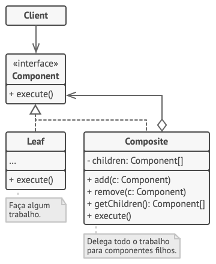
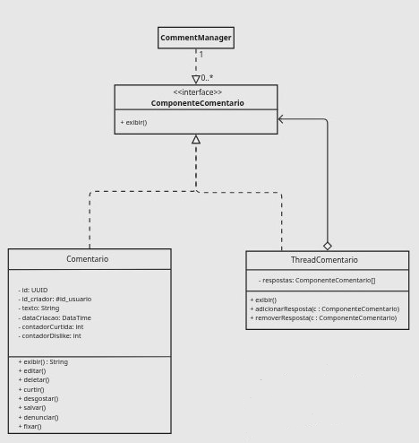
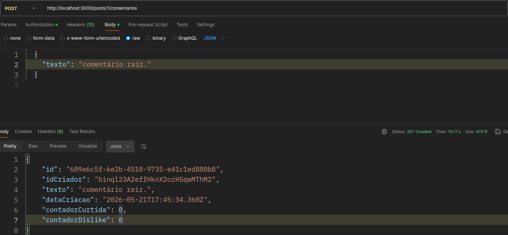
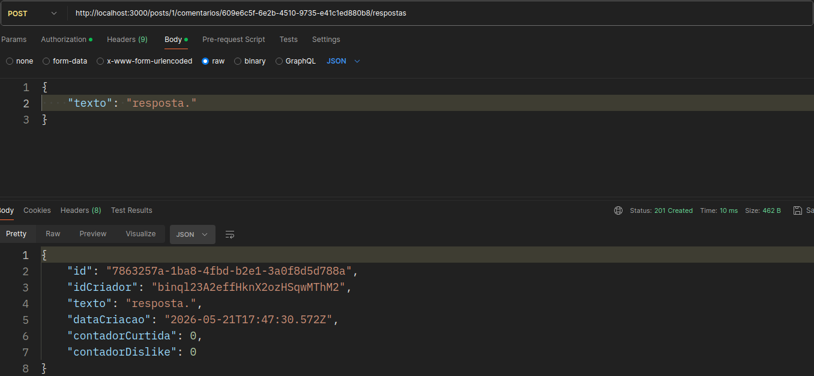
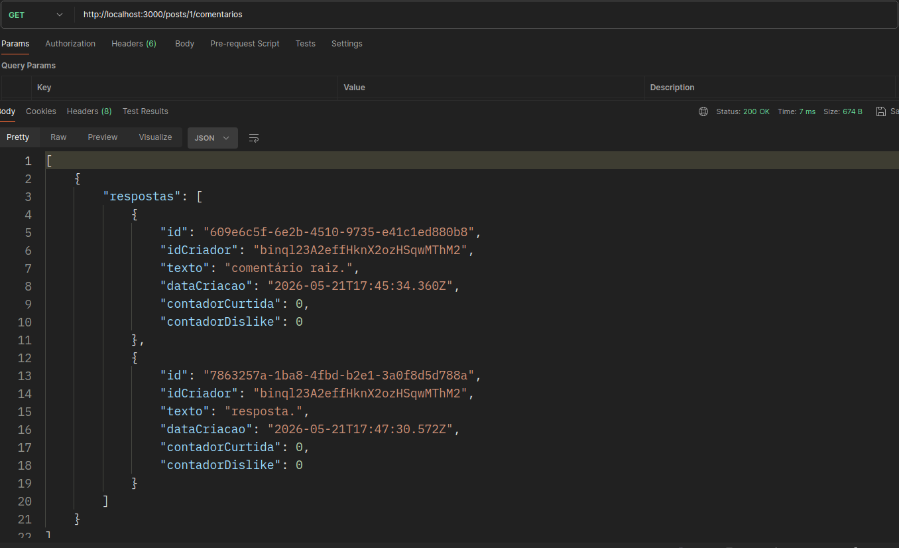
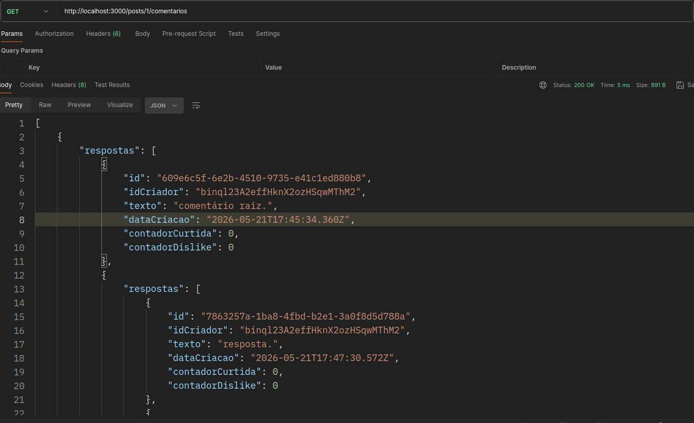
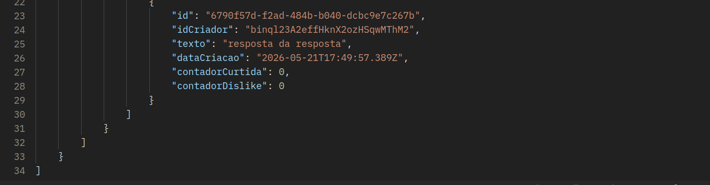
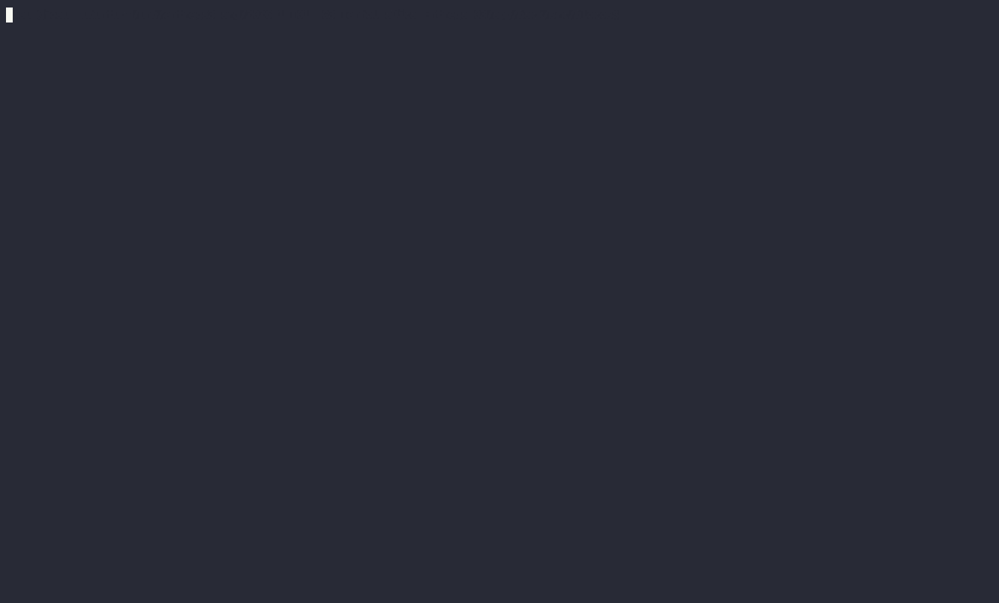

# 3.2.1. Composite – Padrão Estrutural GoF

O **Composite** é um dos padrões de projeto estruturais documentados pela Gang of Four (GoF). Ele tem como objetivo principal compor objetos em estruturas de árvore para representar hierarquias parte-todo. Com isso, o padrão permite que clientes tratem objetos individuais e composições de objetos de maneira uniforme, por meio de uma interface comum.

Esse padrão é especialmente útil quando o sistema precisa lidar com estruturas hierárquicas recursivas — como sistemas de arquivos, menus aninhados ou, no caso do TenhoUmaDica, threads de comentários com respostas encadeadas — sem que o código cliente precise distinguir entre um elemento simples e um composto.

## Quando usar o Composite

O Composite é recomendado nas seguintes situações:

- Quando se quer representar hierarquias parte-todo de objetos.
- Quando se deseja que o código cliente trate objetos simples e compostos de forma uniforme, sem precisar verificar o tipo concreto de cada elemento.
- Quando a estrutura de dados é naturalmente recursiva (ex.: uma resposta pode conter outras respostas).
- Quando adicionar novos tipos de componentes (folha ou composto) não deve exigir modificação do código cliente.

## Estrutura do padrão

O Composite envolve os seguintes participantes:

<div align="center">


<font size="3"><p style="text-align: center">Fonte: <a href="https://refactoring.guru/pt-br/design-patterns/composite" target="_blank">Refactoring Guru</a>, Padrões de projeto estruturais.</p></font>

</div>

- **Component (Componente)**: Define a interface comum para objetos simples e compostos. Declara as operações que ambos devem implementar.
- **Leaf (Folha)**: Representa um objeto simples, sem filhos. Implementa a interface Component e realiza o comportamento concreto.
- **Composite (Composto)**: Armazena uma coleção de filhos (que podem ser Leaf ou outros Composite) e implementa as operações delegando-as aos filhos. Adiciona métodos para gerenciar a coleção.
- **Client (Cliente)**: Interage com os objetos apenas por meio da interface Component, sem distinção entre folhas e compostos.

---

# TenhoUmaDica – Modelagem e Implementação

### Aplicação 1: Gerenciamento de Comentários (CommentManager)

No contexto do fórum acadêmico, os comentários de uma postagem podem ser respondidos por outros comentários, formando uma hierarquia de threads aninhadas. O padrão Composite foi aplicado para modelar essa estrutura, permitindo que um comentário simples e uma thread (contendo vários comentários ou sub-threads) sejam tratados da mesma forma pelo `CommentManager` e pelo restante do sistema.

### Diagrama

Foi elaborado um diagrama com a aplicação do Composite da seguinte forma:

<iframe width="768" height="496" src="https://miro.com/app/live-embed/uXjVMmI8EgA=/?focusWidget=3458764672774984417&embedMode=view_only_without_ui&embedId=458707491889" frameborder="0" scrolling="no" allow="fullscreen; clipboard-read; clipboard-write" allowfullscreen></iframe>

<div align="center">


<font size="3">

<p style="text-align: center">Fonte: 
    <a href="https://github.com/JoaoComTil" target="_blank">João Gabriel</a>,
    <a href="https://github.com/Diogo-Olivv" target="_blank">Diogo</a>,
    Gabriel
</p></font>

</div>

### Classes, Interfaces, Atributos e Métodos

| Elemento                                        | Atributos                                                                                                                                             | Métodos                                                                                                                                    |
| ----------------------------------------------- | ----------------------------------------------------------------------------------------------------------------------------------------------------- | ------------------------------------------------------------------------------------------------------------------------------------------ |
| **CommentManager**                              | _(Nenhum)_                                                                                                                                            | _(Nenhum)_                                                                                                                                 |
| **`<<interface>>`**<br>**ComponenteComentario** | _(Nenhum)_                                                                                                                                            | `+ exibir()`                                                                                                                               |
| **Comentario**                                  | `- id: UUID`<br>`- id_criador: #id_usuario`<br>`- texto: String`<br>`- dataCriacao: DateTime`<br>`- contadorCurtida: int`<br>`- contadorDislike: int` | `+ exibir(): String`<br>`+ editar()`<br>`+ deletar()`<br>`+ curtir()`<br>`+ desgostar()`<br>`+ salvar()`<br>`+ denunciar()`<br>`+ fixar()` |
| **ThreadComentario**                            | `- respostas: ComponenteComentario[]`                                                                                                                 | `+ exibir()`<br>`+ adicionarResposta(c: ComponenteComentario)`<br>`+ removerResposta(c: ComponenteComentario)`                             |

### Relacionamentos e Multiplicidades

| Origem               | Tipo de Relacionamento (Visual)                              | Destino                  | Multiplicidade                          |
| -------------------- | ------------------------------------------------------------ | ------------------------ | --------------------------------------- |
| **CommentManager**   | Associação de Dependência (linha tracejada, seta vazada)     | **ComponenteComentario** | `1` (Manager) para `0..*` (Componentes) |
| **Comentario**       | Realização/Implementação (linha tracejada, triângulo branco) | **ComponenteComentario** | -                                       |
| **ThreadComentario** | Realização/Implementação (linha tracejada, triângulo branco) | **ComponenteComentario** | -                                       |
| **ThreadComentario** | Agregação (linha contínua, losango branco)                   | **ComponenteComentario** | -                                       |

### Como o Composite atua no Fórum

O fluxo de exibição e manipulação de comentários pode ser resumido em:

1. O usuário acessa uma postagem. O `CommentManager` recupera os componentes de comentário associados àquela postagem, sem distinguir se são `Comentario` ou `ThreadComentario`.
2. Para exibir a seção de comentários, o `CommentManager` chama `exibir()` em cada `ComponenteComentario` da raiz.
3. Se o componente for um `Comentario` (folha), ele exibe seu conteúdo diretamente.
4. Se o componente for uma `ThreadComentario` (composto), ele itera sobre sua lista `respostas` e chama `exibir()` recursivamente em cada filho, montando a árvore de respostas.
5. Para adicionar uma resposta, basta chamar `adicionarResposta()` na `ThreadComentario` correspondente, passando qualquer `ComponenteComentario` — seja um comentário simples ou outra thread.

### Vantagens do Composite no contexto do Projeto

- **Uniformidade** – O `CommentManager` e os demais componentes do sistema interagem com `ComponenteComentario` sem precisar verificar se o elemento é um comentário simples ou uma thread com respostas. Isso simplifica o código de renderização e de navegação.

- **Recursividade natural** – A estrutura de threads aninhadas (respostas de respostas) é modelada de forma direta pela relação de agregação entre `ThreadComentario` e `ComponenteComentario`, sem lógica extra no cliente.

- **Extensibilidade** – Novos tipos de componente (como um `ComentarioPinado` ou `ThreadFechada`) podem ser adicionados implementando `ComponenteComentario`, sem alterar o `CommentManager` nem as classes existentes.

- **Facilidade de teste** – Como o cliente depende apenas da interface `ComponenteComentario`, é simples substituir implementações concretas por dublês de teste para verificar a lógica de exibição e gerenciamento de respostas de forma isolada.

## Implementação – Composite

### 1. Interface ComponenteComentario — Component

Define o contrato comum para folhas e compostos. O sistema inteiro interage com comentários exclusivamente por meio desta interface.

```typescript
export interface ComponenteComentario {
  exibir(): string;
}
```

---

### 2. Comentario — Leaf

Representa um comentário individual sem filhos. Implementa `ComponenteComentario` e contém toda a lógica de interação do usuário com um comentário.

```typescript
import { randomUUID } from "crypto";
import { ComponenteComentario } from "../interfaces/componente-comentario.interface";

export class Comentario implements ComponenteComentario {
  private readonly id: string;
  private idCriador: string;
  private texto: string;
  private readonly dataCriacao: Date;
  private contadorCurtida: number;
  private contadorDislike: number;

  constructor(texto: string, idCriador: string) {
    this.id = randomUUID();
    this.texto = texto;
    this.idCriador = idCriador;
    this.dataCriacao = new Date();
    this.contadorCurtida = 0;
    this.contadorDislike = 0;
  }

  getId(): string {
    return this.id;
  }

  exibir(): string {
    return `[Comentario ${this.id}] "${this.texto}" | +${this.contadorCurtida} -${this.contadorDislike}`;
  }

  editar(novoTexto: string): void {
    console.log(`[Comentario ${this.id}] editado`);
    this.texto = novoTexto;
  }

  deletar(): void {
    console.log(`[Comentario ${this.id}] deletado`);
  }

  curtir(): void {
    this.contadorCurtida += 1;
    console.log(
      `[Comentario ${this.id}] curtida — total: ${this.contadorCurtida}`,
    );
  }

  desgostar(): void {
    this.contadorDislike += 1;
    console.log(
      `[Comentario ${this.id}] dislike — total: ${this.contadorDislike}`,
    );
  }

  salvar(): void {
    console.log(`[Comentario ${this.id}] salvo pelo usuário ${this.idCriador}`);
  }

  denunciar(): void {
    console.log(`[Comentario ${this.id}] denunciado`);
  }

  fixar(): void {
    console.log(`[Comentario ${this.id}] fixado`);
  }

  toJSON() {
    return {
      id: this.id,
      idCriador: this.idCriador,
      texto: this.texto,
      dataCriacao: this.dataCriacao,
      contadorCurtida: this.contadorCurtida,
      contadorDislike: this.contadorDislike,
    };
  }
}
```

---

### 3. ThreadComentario — Composite

Representa um nó da árvore de discussão. Armazena uma lista de `ComponenteComentario`, que pode conter tanto `Comentario` (folhas) quanto outras `ThreadComentario` (compostos), permitindo recursividade infinita.

```typescript
import { ComponenteComentario } from "../interfaces/componente-comentario.interface";

export class ThreadComentario implements ComponenteComentario {
  private respostas: ComponenteComentario[];

  constructor() {
    this.respostas = [];
  }

  adicionarResposta(c: ComponenteComentario): void {
    this.respostas.push(c);
    console.log(
      `[ThreadComentario] resposta adicionada — total: ${this.respostas.length}`,
    );
  }

  removerResposta(c: ComponenteComentario): void {
    const index = this.respostas.indexOf(c);
    if (index !== -1) {
      this.respostas.splice(index, 1);
      console.log(
        `[ThreadComentario] resposta removida — total: ${this.respostas.length}`,
      );
    }
  }

  exibir(nivel = 0): string {
    const indent = "  ".repeat(nivel);
    const linhas = this.respostas.map((r) => {
      if (r instanceof ThreadComentario) {
        return r.exibir(nivel + 1);
      }
      return `${indent}  ${r.exibir()}`;
    });
    return `${indent}[Thread]\n${linhas.join("\n")}`;
  }

  getRespostas(): ComponenteComentario[] {
    return this.respostas;
  }

  toJSON(): object {
    return {
      respostas: this.respostas.map((r) =>
        typeof (r as any).toJSON === "function" ? (r as any).toJSON() : r,
      ),
    };
  }
}
```

---

### 4. CommentManager — Client

Gerencia a coleção raiz de componentes de um post. Interage exclusivamente pela interface `ComponenteComentario`, sem distinção entre folhas e compostos.

```typescript
import { ComponenteComentario } from "./interfaces/componente-comentario.interface";

export class CommentManager {
  private componentes: ComponenteComentario[] = [];

  adicionar(componente: ComponenteComentario): void {
    this.componentes.push(componente);
  }

  remover(componente: ComponenteComentario): void {
    const index = this.componentes.indexOf(componente);
    if (index !== -1) this.componentes.splice(index, 1);
  }

  exibirTodos(): string {
    return this.componentes.map((c) => c.exibir()).join("\n");
  }

  getComponentes(): ComponenteComentario[] {
    return this.componentes;
  }
}
```

---

### 5. ComentariosService — Orquestração

Coordena a criação de comentários e respostas, mantendo um `CommentManager` por post e rastreando o pai direto de cada comentário para montar a árvore corretamente.

```typescript
import { Injectable, NotFoundException } from "@nestjs/common";
import { CommentManager } from "./comment-manager";
import { Comentario } from "./models/comentario.model";
import { ThreadComentario } from "./models/thread-comentario.model";
import { ComponenteComentario } from "./interfaces/componente-comentario.interface";

type Contenedor = CommentManager | ThreadComentario;

@Injectable()
export class ComentariosService {
  private readonly managers = new Map<string, CommentManager>();
  private readonly comentariosById = new Map<string, Comentario>();
  private readonly threadByComentarioId = new Map<string, ThreadComentario>();
  private readonly parentByComentarioId = new Map<string, Contenedor>();

  private getOrCreateManager(postId: string): CommentManager {
    if (!this.managers.has(postId)) {
      this.managers.set(postId, new CommentManager());
    }
    return this.managers.get(postId)!;
  }

  private adicionarAoContenedor(
    contenedor: Contenedor,
    componente: ComponenteComentario,
  ): void {
    if (contenedor instanceof CommentManager) {
      contenedor.adicionar(componente);
    } else {
      contenedor.adicionarResposta(componente);
    }
  }

  private removerDoContenedor(
    contenedor: Contenedor,
    componente: ComponenteComentario,
  ): void {
    if (contenedor instanceof CommentManager) {
      contenedor.remover(componente);
    } else {
      contenedor.removerResposta(componente);
    }
  }

  adicionarComentario(
    postId: string,
    texto: string,
    idCriador: string,
  ): Comentario {
    const manager = this.getOrCreateManager(postId);
    const comentario = new Comentario(texto, idCriador);
    this.comentariosById.set(comentario.getId(), comentario);
    manager.adicionar(comentario);
    this.parentByComentarioId.set(comentario.getId(), manager);
    return comentario;
  }

  adicionarResposta(
    postId: string,
    comentarioPaiId: string,
    texto: string,
    idCriador: string,
  ): Comentario {
    const pai = this.comentariosById.get(comentarioPaiId);

    if (!pai) {
      throw new NotFoundException(
        `Comentário ${comentarioPaiId} não encontrado`,
      );
    }

    const resposta = new Comentario(texto, idCriador);
    this.comentariosById.set(resposta.getId(), resposta);

    let thread = this.threadByComentarioId.get(comentarioPaiId);
    if (!thread) {
      thread = new ThreadComentario();
      const contenedor = this.parentByComentarioId.get(comentarioPaiId)!;

      this.removerDoContenedor(contenedor, pai);
      thread.adicionarResposta(pai);
      this.adicionarAoContenedor(contenedor, thread);

      this.parentByComentarioId.set(comentarioPaiId, thread);
      this.threadByComentarioId.set(comentarioPaiId, thread);
    }

    thread.adicionarResposta(resposta);
    this.parentByComentarioId.set(resposta.getId(), thread);
    return resposta;
  }

  listarComentariosJSON(postId: string): object[] {
    const manager = this.getOrCreateManager(postId);
    return manager
      .getComponentes()
      .map((c) =>
        typeof (c as any).toJSON === "function" ? (c as any).toJSON() : c,
      );
  }
}
```

---

### 6. Testes Unitários

Foram implementados testes unitários para cada camada do padrão, cobrindo criação, manipulação da árvore, recursividade e tratamento de erros.

> GIF da execução dos testes:


---

### 7. Evidência de Funcionamento via Postman

Os endpoints a seguir demonstram o padrão em operação sem necessidade de frontend.

**1. Criar comentário raiz**
`POST /posts/:postId/comentarios`



**2. Responder a um comentário**
`POST /posts/:postId/comentarios/:comentarioId/respostas`



**3. Árvore de comentários montada**
`GET /posts/:postId/comentarios`



**4. Exemplo de recursividade. Resposta da resposta**
`POST /posts/:postId/comentarios/:comentarioId/respostas` e
`GET /posts/:postId/comentarios`




---

### Aplicação 2: Gerenciamento de Blocos de Postagem (BlockManager)

No fórum **Tenho Uma Dica**, uma publicação também exige o padrão Composite, pois pode ser composta por diversos elementos visuais de Markdown (Títulos, Códigos, Equações e Listas de Blocos).

O objetivo nesta aplicação é permitir que a classe cliente (`BlockManager`) trate tanto os blocos simples (Folhas, como `BlocoTexto` e `BlocoCodigo`) quanto os agrupamentos complexos (`BlocoLista`) de maneira uniforme, chamando apenas o método genérico `exibir()` através da interface `ComponenteBloco`.

#### Diagrama (BlockManager)

Versão 01 - Diagrama (BlockManager):
<div align="center">

</div>
<p style="text-align: center"> Fonte: 
    <a href="https://github.com/JoaoComTil" target="_blank">João Gabriel</a>,
    <a href="https://github.com/Diogo-Olivv" target="_blank">Diogo</a>,
</p></font>


Versão 02 - Diagrama (BlockManager):
<div align="center">

</div>
<p style="text-align: center"> Fonte: 
    <a href="https://github.com/JoaoComTil" target="_blank">João Gabriel</a>,
    <a href="https://github.com/Diogo-Olivv" target="_blank">Diogo</a>,
    <a href="https://github.com/Diogo-Olivv" target="_blank">Gabriel Augusto</a>
</p></font>

#### Teste 1 - Implementação e Execução Composite (BlockManager)

O padrão Composite garante que o cliente (BlockManager) trate folhas e agrupamentos de forma uniforme. A chamada do método exibir() no nó raiz desencadeia a execução recursiva e polimórfica por toda a árvore de blocos, delegando a renderização naturalmente para cada componente.

```typescript
class BlockManager {
    public static main(): void {
        console.log("Fórum #TenhoUmaDica: Renderizando Postagem");

        // Instanciando folhas genéricas, também chamando os tipos de texto definidos com o Enum
        const titulo = new BlocoTexto("Como usar Padrões de Projeto", TipoTexto.TITULO_1);
        const introducao = new BlocoTexto("Abaixo temos um exemplo de código e uma equação de complexidade.", TipoTexto.NORMAL);
        const codigo = new BlocoCodigo("console.log('Padrão Composite rodando!');", "typescript");
        const equacao = new BlocoEquacao("O(n) = n^2");

        // Instanciando o Composite
        const postagemCompleta = new BlocoLista();
        postagemCompleta.adicionarBloco(titulo);
        postagemCompleta.adicionarBloco(introducao);
        postagemCompleta.adicionarBloco(codigo);
        postagemCompleta.adicionarBloco(equacao);
        const resultadoHTML = postagemCompleta.exibir();
        
        // Chamada uniforme
        console.log("\nResultado final do Markdown:");
        console.log(resultadoHTML);
    }
}
```

Para aferir a pertinência e a qualidade da implementação da primeira versão, segue a gravação da execução do código (**versão 01**) rodando via terminal no ambiente de desenvolvimento: [Clique aqui para assistir ao vídeo da execução do BlockManager](https://youtu.be/vYR2FNTvt2I)

#### Teste - 2 Implementação e Execução Composite (BlockManager)

Segue a implantação de outro teste por meio do arquivo `teste-bloco.ts`



# Referências

1. **MÓDULO DE PADRÕES DE PROJETO ESTRUTURAIS**. _Slides da professora_. Disponível em Aprender3. Acesso em: 21/05/2026.
2. **REFACTORING GURU**. _Padrões de Projeto Estruturais – Composite_. Disponível em: <https://refactoring.guru/pt-br/design-patterns/composite>. Acesso em: 21/05/2026.
3. - OPENAI. ChatGPT. Modelo GPT-4. OpenAI, 2026. Disponível em: <https://chatgpt.com>. Acesso em: 21 maio 2026.

---

# Histórico de versão

| Versão | Descrição                                                        | Autor(es)                                          |    Data    |
| :----: | :--------------------------------------------------------------- | :------------------------------------------------- | :--------: |
|  1.0   | Versão inicial e explicação do diagrama                          | [Felipe Rodrigues](https://github.com/felipeJRdev) | 21/05/2026 |
|  1.1   | Ajustes nas fontes do diagrama                                   | [Felipe Rodrigues](https://github.com/felipeJRdev) | 21/05/2026 |
|  1.2   | Adiciona evidência de implementação e de funcionamento do código | [Felipe Rodrigues](https://github.com/felipeJRdev) | 21/05/2026 |
|  1.3   | Criação da documentação do BlockManager                          | Angélica                                           | 21/05/2026 |
|  1.4   | Adiciona a segunda versão do diagrama do BlockManager            | [Gabriel Augusto](https://github.com/gabrielaugusto23)  | 22/05/2026 |
|  1.5   | Atualiza o bloco de código da classe BlockManager                | [Gabriel Augusto](https://github.com/gabrielaugusto23)  | 22/05/2026 |
