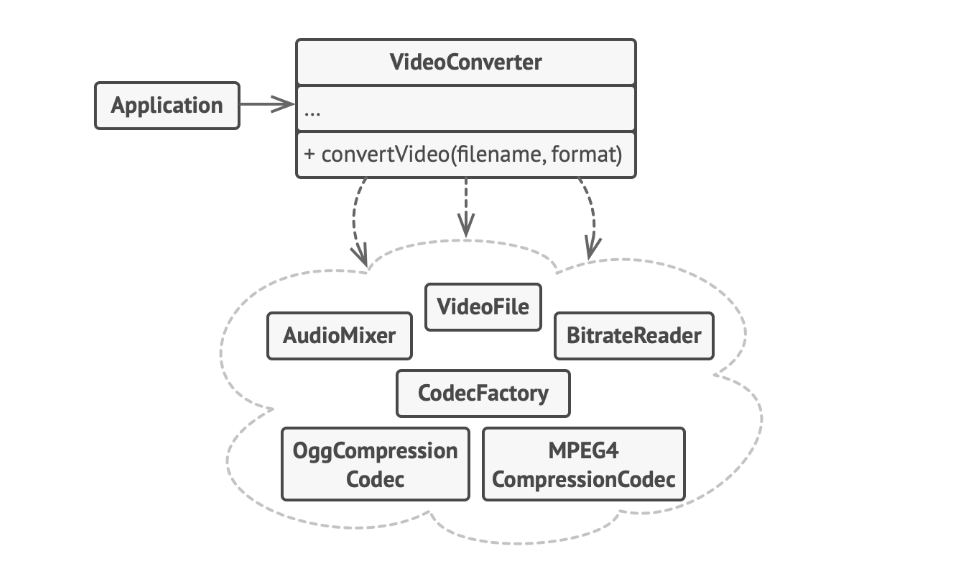
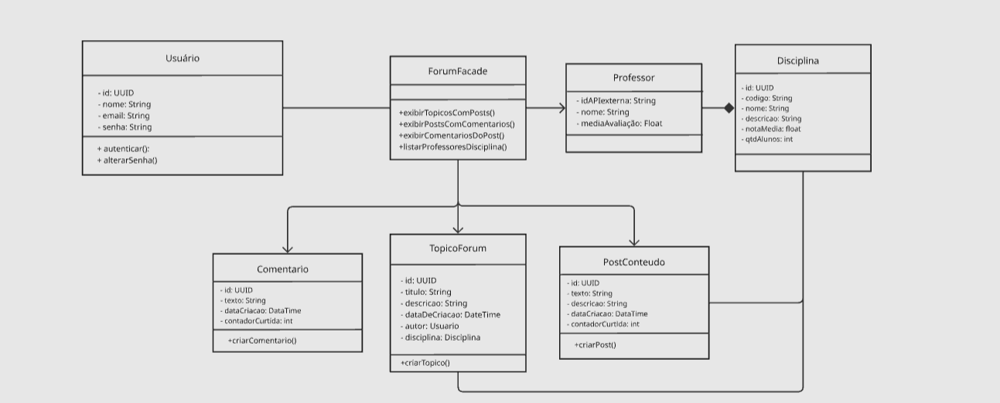

# 3.2.2. Facade – Padrão Estrutural GoF

O **Facade** (Fachada) é um dos padrões de projeto estruturais documentados pela Gang of Four (GoF). Ele tem como objetivo principal fornecer uma interface simplificada para uma biblioteca, um framework ou qualquer conjunto complexo de classes subjacentes. 

Em sistemas muito grandes, os clientes frequentemente precisam interagir com múltiplos componentes de um subsistema (como repositórios, serviços, validadores e APIs externas) para executar uma única tarefa. O Facade resolve esse problema encapsulando toda essa complexidade atrás de uma única classe "Fachada", que expõe apenas os métodos que o cliente realmente se importa, delegando o trabalho pesado para os subsistemas apropriados nos bastidores.

## Quando usar o Facade

O padrão Facade é recomendado nas seguintes situações:

- Quando você precisa ter uma interface limitada, porém direta e simples, para um subsistema complexo.
- Quando você deseja reduzir o acoplamento entre o código cliente (como Controladores) e as regras de negócio internas do sistema.
- Quando você quer estruturar um subsistema em camadas, usando fachadas para definir pontos de entrada para cada nível da arquitetura.

## Estrutura do padrão

O Facade envolve os seguintes participantes:


<font size="3"><p style="text-align: center">Fonte: <a href="https://refactoring.guru/pt-br/design-patterns/facade" target="_blank">Refactoring Guru</a>, Padrões de projeto estruturais.</p></font>

- **Facade (Fachada)**: Fornece um acesso conveniente para uma parte particular da funcionalidade do subsistema. Sabe para onde direcionar o pedido do cliente e como operar as partes móveis.
- **Additional Facade (Fachada Adicional)**: Pode ser criada para evitar poluir uma única fachada com funcionalidades não relacionadas, tornando-a outro sistema complexo.
- **Complex Subsystem (Subsistema Complexo)**: Consiste em dezenas de objetos variados. Para fazê-los fazer algo significativo, é necessário aprofundar-se nos detalhes de implementação do subsistema.
- **Client (Cliente)**: Usa a fachada no lugar de chamar os objetos do subsistema diretamente.

---

# TenhoUmaDica – Modelagem e Implementação

### Aplicação: Orquestração de Dados do Fórum (ForumFacade)
No contexto da nossa plataforma acadêmica, a página principal do Fórum exige a renderização de várias informações simultaneamente: listas de tópicos, postagens com suas respectivas árvores de comentários (que utilizam o padrão Composite) e listas de professores por disciplina. O padrão Facade foi aplicado para que o `ForumController` não precisasse importar todos os serviços envolvidos nem gerenciar a montagem das respostas, centralizando tudo na `ForumFacade`.

### Diagrama

Foi elaborado um diagrama com a aplicação do Facade da seguinte forma:

<iframe width="768" height="496" src="https://miro.com/app/live-embed/uXjVMmI8EgA=/?focusWidget=3458764671399992459&embedMode=view_only_without_ui&embedId=118225829786" frameborder="0" scrolling="no" allow="fullscreen; clipboard-read; clipboard-write" allowfullscreen></iframe>


<font size="3">
<p style="text-align: center">Fonte: 
    <a href="#" target="_blank">Marcos Bezerra</a>
</p></font>

### Classes, Interfaces, Atributos e Métodos

| Elemento | Atributos | Métodos |
| --- | --- | --- |
| **ForumController** | `- forumFacade: ForumFacade` | `+ exibirTopicosComPosts()`<br>`+ exibirPostsComComentarios(postId)`<br>`+ exibirComentariosDoPost(postId)`<br>`+ listarProfessoresDisciplina(disciplinaId)` |
| **ForumFacade** | `- comentariosService: ComentariosService` | `+ exibirTopicosComPosts()`<br>`+ exibirPostsComComentarios(postId)`<br>`+ exibirComentariosDoPost(postId)`<br>`+ listarProfessoresDisciplina(disciplinaId)` |
| **ComentariosService** | *(Omitidos para brevidade)* | `+ listarComentariosJSON(postId)`<br>`+ adicionarComentario(...)`<br>`+ adicionarResposta(...)` |

### Relacionamentos e Multiplicidades

| Origem | Tipo de Relacionamento (Visual) | Destino | Multiplicidade |
| --- | --- | --- | --- |
| **ForumController** | Associação (linha contínua / injeção de dependência) | **ForumFacade** | `1` (Controller) para `1` (Facade) |
| **ForumFacade** | Associação (linha contínua / injeção de dependência) | **ComentariosService** | `1` (Facade) para `1` (Service) |

### Como o Facade atua no Fórum

O fluxo de funcionamento para a exibição de dados no fórum ocorre da seguinte forma:

1. O **Cliente** (neste caso, o `ForumController` que recebe a requisição HTTP) precisa retornar um Post com todos os seus comentários.
2. Em vez de instanciar e chamar o `ComentariosService` e montar a árvore de respostas (Composite), o Controller apenas invoca o método simplificado `exibirPostsComComentarios(postId)` da `ForumFacade`.
3. A `ForumFacade` atua como a orquestradora. Ela aciona o `ComentariosService`, recupera as entidades formatadas e devolve um objeto JSON estruturado.
4. O Controller recebe a resposta pronta e a envia para o front-end, permanecendo limpo e focado apenas em lidar com as requisições web.

### Vantagens do Facade no contexto do Projeto

- **Desacoplamento do Controller** – Os controladores do NestJS no módulo do Fórum não precisam conhecer a fundo as regras de negócio de como um comentário é inserido ou listado.
- **Orquestração de outros padrões** – O Facade abstraiu com sucesso a complexidade gerada pelo padrão estrutural **Composite**. O cliente não precisa saber navegar na árvore de `ThreadComentario`; a fachada entrega a estrutura já montada em formato JSON.
- **Isolamento de Banco de Dados** – Facilita os testes, permitindo testar a lógica de agregação do Fórum isoladamente, sem necessariamente invocar conexões diretas logo na camada de controle.

## Implementação – Facade

### 1. A Fachada (ForumFacade)

Centraliza as chamadas aos microsserviços e subsistemas do fórum.

```typescript
import { Injectable } from '@nestjs/common';
import { ComentariosService } from '../comentarios/comentarios.service';

@Injectable()
export class ForumFacade {
  constructor(private readonly comentariosService: ComentariosService) {}

  public exibirTopicosComPosts(): any {
    return { mensagem: 'Implementação futura: Lista de Tópicos com seus respectivos Posts' };
  }

  public exibirPostsComComentarios(postId: string): any {
    const arvoreDeComentarios = this.comentariosService.listarComentariosJSON(postId);

    return {
      postId: postId,
      comentarios: arvoreDeComentarios
    };
  }

  public exibirComentariosDoPost(postId: string): any {
    return this.comentariosService.listarComentariosJSON(postId);
  }

  public listarProfessoresDisciplina(disciplinaId: string): any {
    return { mensagem: 'Implementação futura: Lista de Professores' };
  }
}
```

<div align="center">


<font size="3">
<p style="text-align: center">
Fonte:
<a href="https://github.com/JoaoComTil" target="_blank">João Gabriel</a>
</p>
</font>

</div>

---

# Referências

1. **MÓDULO DE PADRÕES DE PROJETO ESTRUTURAIS**. *Slides da professora*. Disponível em Aprender3. Acesso em: 21/05/2026.
2. **REFACTORING GURU**. *Padrões de Projeto Estruturais*. Disponível em: https://refactoring.guru/pt-br/design-patterns/structural-patterns. Acesso em: 21/05/2026.

---

# Histórico de versão

| Versão | Descrição | Autor(es) | Data |
| --- | --- | --- | --- |
| 1.0 | Versão inicial, Modelagem e Documentação do Facade | João Ramos | 21/05/2026 |
