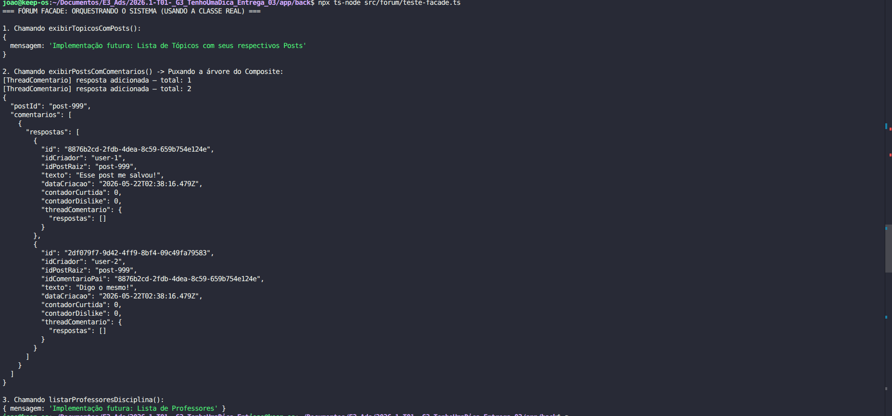

# 3.2.2. Facade – Padrão Estrutural GoF

O **Facade** (Fachada) é um dos padrões de projeto estruturais documentados pela Gang of Four (GoF). Ele tem como objetivo principal fornecer uma interface simplificada para uma biblioteca, um framework ou qualquer conjunto complexo de classes subjacentes. 

Em sistemas muito grandes, os clientes frequentemente precisam interagir com múltiplos componentes de um subsistema (como repositórios, serviços, validadores e APIs externas) para executar uma única tarefa. O Facade resolve esse problema encapsulando toda essa complexidade atrás de uma única classe "Fachada", que expõe apenas os métodos que o cliente realmente se importa, delegando o trabalho pesado para os subsistemas apropriados nos bastidores.

## Quando usar o Facade

O padrão Facade é recomendado nas seguintes situações:

- Quando você precisa ter uma interface limitada, porém direta e simples, para um subsistema complexo.
- Quando você deseja reduzir o acoplamento entre o código cliente (como Controladores) e as regras de negócio internas do sistema.
- Quando você quer estruturar um subsistema em camadas, usando fachadas para definir pontos de entrada para cada nível da arquitetura.

## Estrutura do padrão

O Facade envolve os seguintes participantes:


<font size="3"><p style="text-align: center">Fonte: <a href="https://refactoring.guru/pt-br/design-patterns/facade" target="_blank">Refactoring Guru</a>, Padrões de projeto estruturais.</p></font>

- **Facade (Fachada)**: Fornece um acesso conveniente para uma parte particular da funcionalidade do subsistema. Sabe para onde direcionar o pedido do cliente e como operar as partes móveis.
- **Additional Facade (Fachada Adicional)**: Pode ser criada para evitar poluir uma única fachada com funcionalidades não relacionadas, tornando-a outro sistema complexo.
- **Complex Subsystem (Subsistema Complexo)**: Consiste em dezenas de objetos variados. Para fazê-los fazer algo significativo, é necessário aprofundar-se nos detalhes de implementação do subsistema.
- **Client (Cliente)**: Usa a fachada no lugar de chamar os objetos do subsistema diretamente.

---

# TenhoUmaDica – Modelagem e Implementação

### Aplicação: Orquestração de Dados do Fórum (ForumFacade)
A `ForumFacade` unifica chamadas a `PostsService`, `ComentariosService` e `UsuariosService` e expõe uma API simples sob `/forum/*`. Ela entrega JSONs prontos para o front, incluindo posts completos com a `threadComentario` já normalizada, ocultando detalhes do Composite.

### Diagrama

Foi elaborado um diagrama com a aplicação do Facade da seguinte forma:

<iframe width="768" height="496" src="https://miro.com/app/live-embed/uXjVMmI8EgA=/?focusWidget=3458764671399992459&embedMode=view_only_without_ui&embedId=118225829786" frameborder="0" scrolling="no" allow="fullscreen; clipboard-read; clipboard-write" allowfullscreen></iframe>


<font size="3">
<p style="text-align: center">Fonte: 
    <a href="#" target="_blank">Marcos Bezerra</a>
</p></font>

### Classes, Interfaces, Atributos e Métodos (resumo)

| Elemento | Métodos públicos relevantes |
| --- | --- |
| **ForumController** | `GET /forum/topicos` → `exibirTopicosComPosts()` |
| **ForumController** | `POST /forum/topicos` → `criarTopico(dto: { titulo, conteudo })` (autenticado) |
| **ForumController** | `GET /forum/posts/:postId/completo` → `exibirPostsComComentarios(postId)` |
| **ForumController** | `POST /forum/posts/:postId/comentarios` → `adicionarComentario(...)` (autenticado) |
| **ForumController** | `POST /forum/posts/:postId/comentarios/:comentarioId/respostas` → `adicionarResposta(...)` (autenticado) |
| **ForumFacade** | orquestra `PostsService`, `ComentariosService`, `UsuariosService` e normaliza `threadComentario` como JSON. |

### Relacionamentos e Multiplicidades

| Origem | Tipo de Relacionamento (Visual) | Destino | Multiplicidade |
| --- | --- | --- | --- |
| **ForumController** | Associação (linha contínua / injeção de dependência) | **ForumFacade** | `1` (Controller) para `1` (Facade) |
| **ForumFacade** | Associação (linha contínua / injeção de dependência) | **ComentariosService** | `1` (Facade) para `1` (Service) |

### Como o Facade atua no Fórum (fluxo)

1. O `ForumController` chama `ForumFacade` para operar sobre posts e comentários (por exemplo `exibirPostsComComentarios`).
2. A `ForumFacade` recupera o post via `PostsService` e a árvore via `ComentariosService`.
3. Ela normaliza a `threadComentario` (respostas aninhadas) e devolve o post completo em formato JSON.
4. O Controller simplesmente retorna o JSON ao front.

### Vantagens do Facade no contexto do Projeto

- **Desacoplamento** – Controllers não precisam conhecer serviços internos nem detalhes do Composite.
- **Contratos claros** – A criação de tópicos usa o DTO `{ titulo, conteudo }`; a validação é aplicada via `ValidationPipe` antes da fachada.
- **Normalização de estrutura** – A fachada entrega `threadComentario` já normalizada, evitando vazamento de estruturas internas para o front.
- **Migração/limpeza da API** – Endpoints legados (`PostsController`, `ComentariosController`) foram removidos; `/forum/*` centraliza o acesso.

## Implementação – Facade

### 1. A Fachada (ForumFacade)

Centraliza as chamadas aos microsserviços e subsistemas do fórum.

```typescript
import { Injectable } from '@nestjs/common';
import { ComentariosService } from '../comentarios/comentarios.service';
import { PostsService } from '../posts/posts.service';
import { UsuariosService } from '../usuarios/usuarios.service';
import { Usuario } from '../usuarios/models/usuario';
import { TopicoDto } from './dtos/topico.dto';
import { ComentarioDto } from './dtos/comentario.dto';
import { PostDto } from './dtos/post.dto';

@Injectable()
export class ForumFacade {
  constructor(
    private readonly comentariosService: ComentariosService,
    private readonly postsService: PostsService,
    private readonly usuariosService: UsuariosService,
  ) {}

  public exibirTopicosComPosts(): any {
    return this.postsService.listarPosts();
  }

  public exibirPostsComComentarios(postId: string): any {
    const post = this.postsService
      .listarPosts()
      .find((item: any) => item.id === postId);

    const arvoreDeComentarios = this.comentariosService.listarComentariosJSON(postId);

    return {
      ...(post ?? {
        id: postId,
        tipo: 'topico',
        texto: '',
        descricao: '',
        dataCriacao: new Date().toISOString(),
        contadorCurtida: 0,
        idCriador: '',
      }),
      threadComentario: {
        respostas: this.normalizarThreadComentarios(arvoreDeComentarios),
      },
    };
  }

  public exibirComentariosDoPost(postId: string): any {
    return this.comentariosService.listarComentariosJSON(postId);
  }

  public async criarTopico(dto: TopicoDto, user?: any): Promise<any> {
    const criador = new Usuario(user?.uid ?? user?.id ?? 'anon', user?.name ?? user?.nome ?? 'Anon', user?.email ?? 'anon@example.com');
    const post = this.postsService.criarPostTopico(dto.conteudo, dto.titulo, criador);
    return post.toJSON();
  }

  public async criarAvaliacao(dto: PostDto, user?: any): Promise<any> {
    const criador = new Usuario(user?.uid ?? user?.id ?? dto.autorId ?? 'anon', user?.name ?? user?.nome ?? 'Anon', user?.email ?? 'anon@example.com');
    const post = this.postsService.criarPostAvaliacao(dto.texto, dto.descricao ?? '', criador);
    return post.toJSON();
  }

  public adicionarComentario(dto: ComentarioDto, userId?: string): any {
    const comentario = this.comentariosService.adicionarComentario(dto.postId ?? '', dto.texto, userId ?? dto.autorId ?? 'anon');
    return comentario.toJSON();
  }

  public adicionarResposta(postId: string, comentarioPaiId: string, texto: string, userId?: string): any {
    const resposta = this.comentariosService.adicionarResposta(postId, comentarioPaiId, texto, userId ?? 'anon');
    return resposta.toJSON();
  }

  public listarProfessoresDisciplina(disciplinaId: string): any {
    return { mensagem: 'Implementação futura: Lista de Professores' };
  }

  private normalizarThreadComentarios(items: any[]): any[] {
    return items.flatMap((item) => {
      const nestedResponses =
        item?.threadComentario?.respostas ?? item?.respostas ?? [];

      if (!item || typeof item !== 'object') {
        return [];
      }

      if (!('texto' in item)) {
        const normalizedNestedResponses =
          this.normalizarThreadComentarios(nestedResponses);

        if (normalizedNestedResponses.length === 0) {
          return [];
        }

        const [parentComment, ...replyComments] = normalizedNestedResponses;

        return [
          {
            ...parentComment,
            threadComentario: {
              respostas: replyComments,
            },
          },
        ];
      }

      return [
        {
          ...item,
          threadComentario: {
            respostas: this.normalizarThreadComentarios(nestedResponses),
          },
        },
      ];
    });
  }
}
```

<div align="center">



<font size="3">
<p style="text-align: center">
Fonte:
<a href="https://github.com/Joaolramos" target="_blank">João Ramos</a>
</p>
</font>

</div>

<div align="center">

<iframe src="https://drive.google.com/file/d/1itzr_XoN-wo9JGPCS6156o56NMMgAG_2/preview" width="640" height="480"></iframe>

<font size="3">
<p style="text-align: center">
Fonte:
<a href="https://github.com/Brwnds" target="_blank">Brenda Silva</a>
</p>
</font>

</div>

---

# Referências

1. **MÓDULO DE PADRÕES DE PROJETO ESTRUTURAIS**. *Slides da professora*. Disponível em Aprender3. Acesso em: 21/05/2026.
2. **REFACTORING GURU**. *Padrões de Projeto Estruturais*. Disponível em: https://refactoring.guru/pt-br/design-patterns/structural-patterns. Acesso em: 21/05/2026.

---

# Histórico de versão

| Versão | Descrição | Autor(es) | Data |
| --- | --- | --- | --- |
| 1.0 | Versão inicial, Modelagem e Documentação do Facade | João Ramos | 21/05/2026 |
| 1.1 | Atualiza documentação e código do Facade, adiciona vídeo do funcionamento | Brenda Silva | 22/05/2026 |