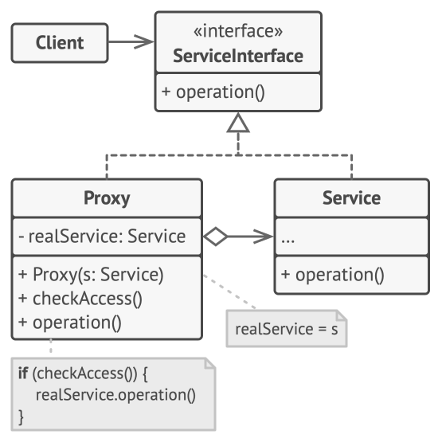
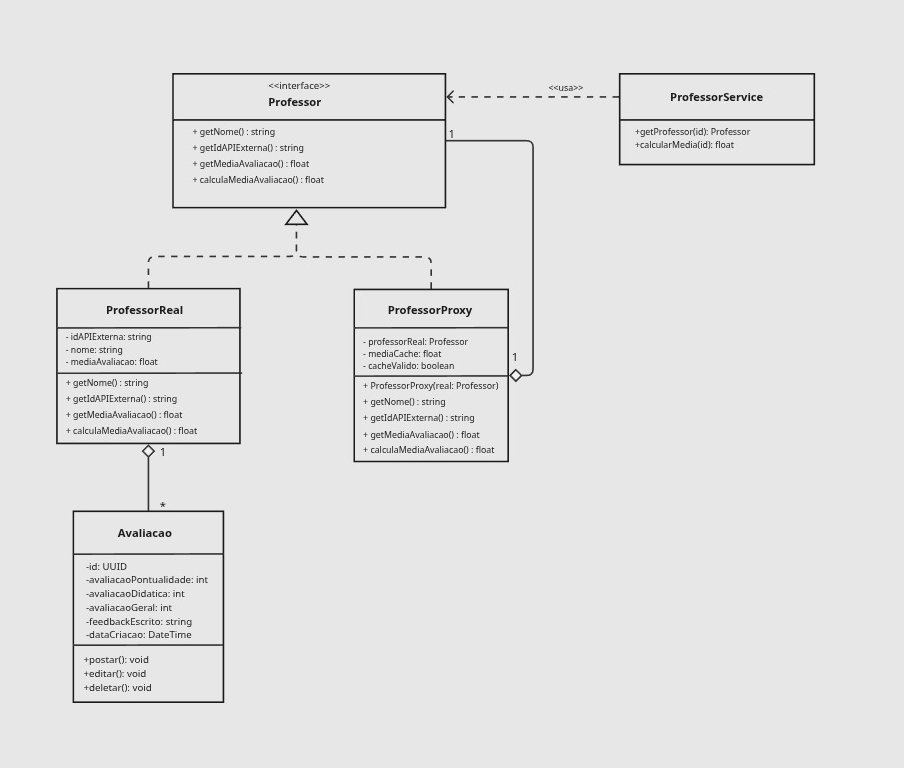

# 3.2.3. Proxy – Padrão Estrutural GoF

O **Proxy** é um dos padrões de projeto estruturais documentados pela Gang of Four (GoF). Ele tem como objetivo principal fornecer um substituto ou espaço reservado para outro objeto, permitindo controlar o acesso a esse objeto original. Com isso, é possível executar ações antes ou depois de um pedido chegar ao objeto real — como cache de resultados custosos, verificações de permissão ou registro de chamadas —, sem que o cliente precise saber que está interagindo com um intermediário.

Esse padrão é especialmente útil quando o objeto real realiza operações caras (como cálculos complexos ou chamadas a APIs externas) que podem ser evitadas por meio de cache, quando é necessário restringir o acesso com base em regras de autorização, ou quando se deseja adicionar comportamentos transversais de forma transparente ao cliente.

## Quando usar o Proxy

O Proxy é recomendado nas seguintes situações:

- **Inicialização preguiçosa (Virtual Proxy)**: quando há um objeto pesado que consome recursos do sistema e que deve ser criado apenas quando realmente necessário, evitando custos desnecessários na inicialização.
- **Controle de acesso (Protection Proxy)**: quando diferentes clientes devem ter diferentes níveis de acesso ao objeto real, e é preciso verificar permissões antes de delegar a chamada.
- **Execução remota (Remote Proxy)**: quando o objeto real reside em um servidor remoto e o proxy gerencia a comunicação de rede de forma transparente para o cliente.
- **Cache de resultados (Caching Proxy)**: quando operações repetidas retornam os mesmos resultados e é desejável armazenar respostas em cache para evitar chamadas redundantes ao serviço real.
- **Registro de chamadas (Logging Proxy)**: quando se precisa manter um histórico de acesso ao serviço para fins de auditoria ou depuração.
- **Referência inteligente**: quando se deseja liberar ou gerenciar o ciclo de vida de um objeto compartilhado assim que nenhum cliente mais o utiliza.

## Estrutura do padrão

O Proxy envolve os seguintes participantes:


<font size="3"><p style="text-align: center">Fonte: <a href="https://refactoring.guru/pt-br/design-patterns/proxy" target="_blank">Refactoring Guru</a>, Padrões de projeto estruturais.</p></font>

- **ServiceInterface (Interface do Serviço)**: Define o contrato comum que tanto o serviço real quanto o proxy devem implementar. O cliente interage exclusivamente por meio desta interface.
- **Service (Serviço Real)**: Classe que contém a lógica de negócio concreta. O proxy mantém uma referência a ela e delega as chamadas quando necessário.
- **Proxy**: Implementa a mesma interface que o serviço real. Contém uma referência ao serviço e executa ações adicionais (cache, verificação de acesso, log etc.) antes ou depois de delegar a chamada ao serviço real.
- **Client (Cliente)**: Trabalha com o serviço exclusivamente pela interface, sem distinção entre o objeto real e o proxy.

---

## Tenho Uma Dica – Modelagem e Implementação

### Aplicação: Cache de Média de Avaliação de Professores (ProfessorProxy)

No fórum acadêmico **TenhoUmaDica**, os usuários podem avaliar professores em dimensões como pontualidade, didática e desempenho geral. O cálculo da média de avaliação (`calculaMediaAvaliacao`) é uma operação potencialmente custosa: ela consulta todas as avaliações associadas ao professor e pode envolver chamadas a uma API externa identificada por `idAPIexterna`.

Como essa média é consultada com frequência — exibida em listagens, perfis e rankings — recalculá-la a cada requisição seria ineficiente. O padrão **Proxy de Cache** foi aplicado por meio da classe `ProfessorProxy`, que implementa a mesma interface `Professor` do `ProfessorReal` e armazena o resultado do último cálculo nos atributos `mediaCache` e `cacheValido`. Enquanto o cache é válido, o `ProfessorProxy` retorna o valor armazenado sem acionar o `ProfessorReal`. Quando uma nova avaliação é registrada (invalidando o cache), o próximo acesso recalcula e armazena o novo valor.

O `ProfessorService` interage exclusivamente com a interface `Professor`, sem nenhum conhecimento sobre qual implementação está por trás.

### Diagrama versão inicial

Foi elaborado um diagrama com a aplicação do Proxy da seguinte forma:

<iframe width="768" height="496" src="https://miro.com/app/live-embed/uXjVMmI8EgA=/?focusWidget=3458764672909106465&embedMode=view_only_without_ui&embedId=700380834957" frameborder="0" scrolling="no" allow="fullscreen; clipboard-read; clipboard-write" allowfullscreen></iframe>


<font size="3">
<p style="text-align: center">Fonte: 
    <a href="https://github.com/felipeJRdev" target="_blank">Felipe Rodrigues</a>,
    <a href="https://github.com/Joaolramos" target="_blank">João Lucas</a>,
    <a href="https://github.com/angelicaccampos" target="_blank">Angélica</a>
</p></font>

### Diagrama segunda versão

**Evolução Arquitetural (V2):** O diagrama original passou por uma refatoração rigorosa para se alinhar estritamente à teoria da disciplina. Foram adicionados os modificadores de encapsulamento privado, a relação de **Agregação** justificando que o Proxy "possui" a instância do objeto real, e uma nota UML evidenciando a lógica exata de interceptação antes da delegação da chamada.


<font size="3">
<p style="text-align: center">Fonte: 
    <a href="https://github.com/felipeJRdev" target="_blank">Felipe Rodrigues</a>,
    <a href="https://github.com/Joaolramos" target="_blank">João Lucas</a>,
    <a href="https://github.com/angelicaccampos" target="_blank">Angélica</a>
</p></font>

O padrão foi totalmente codificado e testado no repositório do projeto.

### Classes, Interfaces, Atributos e Métodos

| Elemento | Atributos | Métodos |
| --- | --- | --- |
| **`<<interface>>`**<br>**Professor** | *(Nenhum)* | `+ getNome(): string`<br>`+ getIdAPIexterna(): string`<br>`+ getMediaAvaliacao(): float`<br>`+ calculaMediaAvaliacao(): float` |
| **ProfessorReal** | `- idAPIexterna: string`<br>`- nome: string`<br>`- mediaAvaliacao: float` | `+ getNome(): string`<br>`+ getIdAPIexterna(): string`<br>`+ getMediaAvaliacao(): float`<br>`+ calculaMediaAvaliacao(): float` |
| **ProfessorProxy** | `- professorReal: Professor`<br>`- mediaCache: float`<br>`- cacheValido: boolean` | `+ ProfessorProxy(real: Professor)`<br>`+ getNome(): string`<br>`+ getIdAPIexterna(): string`<br>`+ getMediaAvaliacao(): float`<br>`+ calculaMediaAvaliacao(): float` |
| **Avaliacao** | `- id: UUID`<br>`- avaliacaoPontualidade: int`<br>`- avaliacaoDidatica: int`<br>`- avaliacaoGeral: int`<br>`- feedbackEscrito: string`<br>`- dataCriacao: DateTime` | `+ postar(): void`<br>`+ editar(): void`<br>`+ deletar(): void` |
| **ProfessorService** | *(Nenhum)* | `+ getProfessor(id): Professor`<br>`+ calcularMedia(id): float` |

### Relacionamentos e Multiplicidades

| Origem | Tipo de Relacionamento (Visual) | Destino | Multiplicidade |
| --- | --- | --- | --- |
| **ProfessorReal** | Realização/Implementação (linha tracejada, triângulo branco) | **Professor** | - |
| **ProfessorProxy** | Realização/Implementação (linha tracejada, triângulo branco) | **Professor** | - |
| **ProfessorProxy** | Agregação (linha contínua, losango branco) | **Professor** | `1` (Proxy) para `1` (professorReal) |
| **ProfessorReal** | Agregação (linha contínua, losango branco) | **Avaliacao** | `1` (Professor) para `*` (Avaliações) |
| **ProfessorService** | Associação de Dependência (linha tracejada, seta aberta) | **Professor** | - |

### Como o Proxy atua no Fórum

O fluxo de consulta e cálculo de média de avaliação pode ser resumido em:

1. O `ProfessorService` recebe uma instância de `Professor` — que na prática é um `ProfessorProxy` — e chama `calculaMediaAvaliacao()` sem saber com qual implementação está interagindo.
2. Na primeira chamada, `cacheValido` é `false`. O `ProfessorProxy` delega a chamada ao `ProfessorReal`, que percorre todas as avaliações, calcula a média e retorna o resultado.
3. O proxy armazena o resultado em `mediaCache` e marca `cacheValido = true`.
4. Nas chamadas seguintes, `cacheValido` é `true` e o proxy retorna `mediaCache` diretamente, sem acionar o `ProfessorReal`.
5. Quando uma nova avaliação é registrada, o proxy invalida o cache (`cacheValido = false`). O próximo acesso a `calculaMediaAvaliacao()` recalcula e atualiza o cache.

### Vantagens do Proxy no contexto do Projeto

- **Desempenho** – O cálculo da média, que pode envolver múltiplas avaliações e chamada a API externa, é realizado apenas quando necessário. Requisições subsequentes recebem resposta imediata do cache.

- **Transparência para o cliente** – O `ProfessorService` e qualquer outro cliente que dependa de `Professor` não precisam ser alterados para obter o benefício do cache; a lógica fica completamente encapsulada no `ProfessorProxy`.

- **Separação de responsabilidades** – O `ProfessorReal` mantém foco exclusivo na lógica de negócio do professor e suas avaliações, sem nenhum conhecimento de estratégia de cache.

- **Extensibilidade** – Um novo proxy (ex.: `ProfessorLoggingProxy`) pode ser encadeado ao `ProfessorProxy` sem alterar nenhuma das classes existentes, seguindo o Princípio Aberto/Fechado.

## Implementação – Proxy

### 1. Interface Professor — Subject
Define o contrato comum. O sistema inteiro interage com os professores (seja o objeto real ou o interceptador) exclusivamente por meio desta interface, garantindo o polimorfismo.

```typescript
export interface Professor {
    getNome(): string;
    getIdAPIExterna(): string;
    getMediaAvaliacao(): number; 
    calculaMediaAvaliacao(): number;
}
```

### 2. Avaliacao — Entidade Auxiliar


```typescript
export class Avaliacao {
    private id: string; 
    private avaliacaoPontualidade: number;
    private avaliacaoDidatica: number;
    private avaliacaoGeral: number;
    private feedbackEscrito: string;
    private dataCriacao: Date; 

    constructor(
        id: string, 
        avaliacaoPontualidade: number, 
        avaliacaoDidatica: number, 
        avaliacaoGeral: number, 
        feedbackEscrito: string, 
        dataCriacao: Date
    ) {
        this.id = id;
        this.avaliacaoPontualidade = avaliacaoPontualidade;
        this.avaliacaoDidatica = avaliacaoDidatica;
        this.avaliacaoGeral = avaliacaoGeral;
        this.feedbackEscrito = feedbackEscrito;
        this.dataCriacao = dataCriacao;
    }

    public postar(): void {
        console.log(`[Avaliacao] A avaliação ${this.id} foi postada com sucesso.`);
    }

    public editar(): void {
        console.log(`[Avaliacao] A avaliação ${this.id} foi editada.`);
    }

    public deletar(): void {
        console.log(`[Avaliacao] A avaliação ${this.id} foi deletada.`);
    }

    public getAvaliacaoGeral(): number {
        return this.avaliacaoGeral;
    }
}
```

### 3. ProfessorReal — RealSubject

```typescript
import { Professor } from './Professor';
import { Avaliacao } from './Avaliacao';

export class ProfessorReal implements Professor {
    private idAPIExterna: string;
    private nome: string;
    private mediaAvaliacao: number; 
    private avaliacoes: Avaliacao[];

    constructor(idAPIExterna: string, nome: string, avaliacoes: Avaliacao[] = []) {
        this.idAPIExterna = idAPIExterna;
        this.nome = nome;
        this.avaliacoes = avaliacoes;
        this.mediaAvaliacao = 0;
    }

    public getNome(): string {
        return this.nome;
    }

    public getIdAPIExterna(): string {
        return this.idAPIExterna;
    }

    public calculaMediaAvaliacao(): number {
        console.log(" [ProfessorReal] Consultando BD e processando a média das avaliações");
        
        if (this.avaliacoes.length === 0) {
            this.mediaAvaliacao = 0;
            return this.mediaAvaliacao;
        }

        const soma = this.avaliacoes.reduce((acc, avaliacao) => acc + avaliacao.getAvaliacaoGeral(), 0);
        this.mediaAvaliacao = soma / this.avaliacoes.length;
        
        return this.mediaAvaliacao;
    }

    public getMediaAvaliacao(): number {
        return this.calculaMediaAvaliacao();
    }

    public adicionarAvaliacao(avaliacao: Avaliacao): void {
        this.avaliacoes.push(avaliacao);
    }
}
```

### 4. ProfessorProxy — Proxy (Interceptador de Cache)


### 5. ProfessorService — Client


# Referências

1. **MÓDULO DE PADRÕES DE PROJETO ESTRUTURAIS**. *Slides da professora*. Disponível em Aprender3. Acesso em: 22/05/2026.
2. **REFACTORING GURU**. *Padrões de Projeto Estruturais – Proxy*. Disponível em: <https://refactoring.guru/pt-br/design-patterns/proxy>. Acesso em: 22/05/2026.
3. OPENAI. ChatGPT. Modelo GPT-4. OpenAI, 2026. Disponível em: https://chatgpt.com. Acesso em: 22 maio 2026.

---

# Histórico de versão

| Versão | Descrição | Autor(es) | Data |
| :----: | :--- | :--- | :---: |
| 1.0 | Versão inicial com estrutura, diagrama e implementação do Proxy | [Felipe Rodrigues](https://github.com/felipeJRdev) | 22/05/2026 |
| 1.1 | Adiciona diagrama v2 e implementação do Proxy | Angélica | 22/05/2026 |
