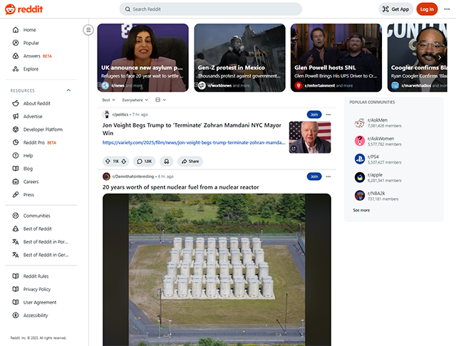

# TenhoUmaDica

**Código da Disciplina:** FGA0208 - Arquitetura e Desenho de Software  
**Número do Grupo:** 03  
**Entrega:** 02

## Apresentação

Este projeto foi desenvolvido para a disciplina **Arquitetura e Desenho de Software**, ministrada pela professora **Milene Serrano**.

O projeto é inspirado no **Reddit**, uma rede social baseada em fóruns onde os próprios usuários gerenciam e ranqueiam o conteúdo através de votos em comunidades de interesse.

Imagem 1: Screenshot Reddit

  

Fonte: <a href="http://en.wikipedia.org/wiki/Reddit" target="_blank">Wikipedia</a>, 2026.

Adaptando essa lógica para a realidade da **FCTE/UnB**, idealizamos uma plataforma voltada para a colaboração acadêmica, resolvendo o problema da informação fragmentada em grupos de mensagens que se perdem com o tempo.

O foco central é a troca direta entre veteranos e calouros: enquanto os estudantes mais experientes compartilham materiais e dicas de como lidar com os desafios acadêmicos, os recém-chegados encontram um suporte organizado para sua trajetória no campus. Além dos fóruns de disciplinas, o sistema permite classificar professores e o nível de dificuldade das matérias, criando um histórico que auxilia no planejamento dos semestres e fortalece a rede de apoio entre os alunos.

## Alunos

| Matrícula  | Aluno                                                  |
| :--------- | :----------------------------------------------------- |
| 22/1031256 | [Angélica](https://github.com/angelicaccampos)         |
| 23/1011963 | [Brenda](https://github.com/Brwnds)                    |
| 23/1011266 | [Diogo](https://github.com/Diogo-Olivv)                |
| 21/1062867 | [Felipe Rodrigues](https://github.com/felipeJRdev)     |
| 22/1022533 | [Gabriel Augusto](https://github.com/gabrielaugusto23) |
| 22/1022560 | [Gabriel Maciel](https://github.com/GabrielMacielBR)   |
| 22/1022005 | [João Gabriel](https://github.com/JoaoComTil)          |
| 21/1061930 | [João Lucas](https://github.com/Joaolramos)            |
| 21/1062698 | [Marcos Bezerra](https://github.com/marcoslbz)         |
| 22/1022435 | [Renan](https://github.com/rsribeiro1)                 |

## Sobre

O projeto **TenhoUmaDica** surgiu da necessidade de centralizar e organizar o conhecimento informal compartilhado entre os estudantes da Faculdade UnB Gama (FCTE). A plataforma funciona como um repositório de dicas acadêmicas, onde a colaboração é incentivada por meio de um sistema de gamificação.

A base conceitual do projeto foi construída utilizando metodologias de **Design Sprint**, focando na experiência do usuário e na viabilidade técnica. Para entender mais sobre a fundamentação do projeto, acesse a documentação completa no repositório da primeira fase:

- [Repositório da Entrega 01 - Requisitos e Planejamento](https://unbarqdsw2026-1-turma01.github.io/2026.1-T01-_G3_TenhoUmaDica_Entrega_01/#/)

## Screenshots da Terceira Entrega

Adicione 2 ou mais screenshots em termos de artefatos realizados na entrega.

## Há algo a ser executado?

( ) SIM
( X ) NÃO

Se SIM, insira um manual (ou um script) para auxiliar ainda mais os interessados na execução.

## Informações Complementares

---

## Histórico de Versão

| Versão | Descrição              | Autor(es)      |    Data    |
| :----: | :--------------------- | :------------- | :--------: |
|  1.0   | Estruturação da pagina | Diogo Oliveira | 28/04/2026 |
